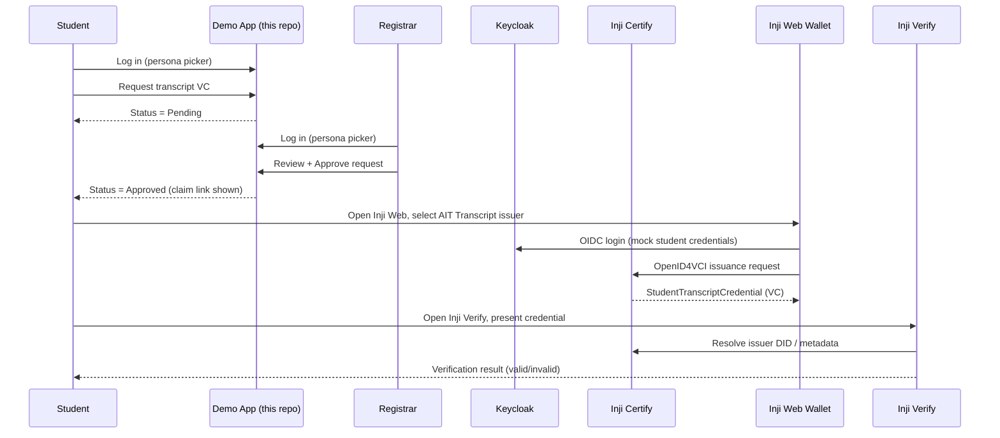

# AIT Transcript VC Journey — Demo PRD

## 1. Purpose

A self-contained, local demo showing internal AIT stakeholders how a **student academic transcript** becomes a **Verifiable Credential (VC)**: a student requests it, a registrar approves it, the student claims it into **Inji Web Wallet**, and a verifier checks it with **Inji Verify**.

**Primary focus, in priority order:** (1) the student can hold the transcript VC in Inji Web Wallet and present it to Inji Verify — this is the part of the journey that must work reliably; (2) the credential, once opened, must **look like the official AIT Master Transcript** — the exact design already built in Credential Lab (`aittranscript` preset), vendored verbatim into [design/](./design/), not a simplified re-imagining. The request/approval workflow (§6.1.1) exists to motivate the journey for stakeholders, but it is secondary to getting the wallet-hold-and-present step, and the transcript's visual fidelity, right.

This is a **stakeholder demo**, not a production pilot. It is a separate repo from the upstream `inji` sandbox (not included here) and does not modify or depend on that repo's running sandbox — it borrows *patterns and schema design* from it (vc-stack Docker Compose shape, Credential Lab's `aittranscript` claim/PDF design), and vendors what it needs locally.

## 2. Audience

Internal AIT stakeholders watching a live walkthrough (screen share or in person). Not end users, not a security review. Optimize for a clear, reliable, repeatable demo script over completeness or hardening.

**Secondary audience (added 2026-09-17):** this repo will be handed to a colleague to continue development after the initial demo. That means the whole system — including the demo app itself, not just the Inji stack — must run from `docker compose up` alone. A colleague picking this up should never need to set up a host Python environment, matching dependency versions, or anything beyond Docker to get a working copy running.

## 3. Non-goals

- No GCP, no Terraform, no Kubernetes, no Credential Lab control plane. Everything is `docker compose`.
- No real student directory / LDAP. Mock data only.
- No production trust framework (`did:web`, VDR/VCGA, Trusted Issuers List). Sandbox `did:key`/local signing is fine, matching vc-stack's default.
- No real enforcement of the approval gate at the credential-issuance layer (see §6.3 — deliberate scope cut, not an oversight).
- No multi-registrar workflow, no notifications/email, no audit trail beyond a status log.
- Not a reusable framework for other credential types — this repo is scoped to the transcript journey only.

## 4. Actors

| Actor | Role in the journey |
|---|---|
| **Student** | Logs into the demo app (persona picker), requests their transcript VC, later claims it into Inji Web Wallet, presents it to Inji Verify. |
| **Registrar** | Logs into the demo app as the approver persona, reviews pending requests, approves or rejects. |
| **Inji Web** | Browser wallet. Student authenticates via Keycloak and downloads the issued VC. |
| **Inji Verify** | Browser verifier. Requests a presentation and shows the verification result. |

## 5. End-to-end journey

## 6. Scope

### 6.1 In scope

1. **Demo web app** — one FastAPI app/deployment, but **two portal URLs** so a presenter can have both open in separate browser tabs at once and watch a registrar decision land on the student's screen live, rather than logging out and switching identity on a single shared login page:
   - **Student portal** (`/student`): persona picker scoped to the 5 student personas → own mock transcript summary, submit a transcript VC request, see status (`pending` / `approved` / `rejected`), and — once approved — a "Claim your credential" panel with a deep link to Inji Web and the mock Keycloak login to use there.
   - **Registrar portal** (`/registrar`): persona picker scoped to the registrar persona(s) → see all requests, approve or reject with one click, see a running log.
   - "Open Inji Verify" link/button always visible in the student portal once that student has a claimed credential, for the presentation step.
   - Both portals share the same backend, request/approval state, and mock-data fixture — this is an IA split (two entry URLs), not two separate deployments or databases.
   - **The app itself is a Docker service** in the same `docker-compose.yaml` as the Inji stack (its own `Dockerfile`, its own entry in the compose file) — not a script that shells out to a host-installed Python/uvicorn. See §2's secondary-audience note: this is a handoff requirement, not just tidiness.
2. **Local Docker stack** for the Inji side, vendored into this repo: PostgreSQL, Inji Certify (+ nginx), Mimoto, Keycloak (+ nginx), Inji Web, Inji Verify (service + UI), public gateway — same shape as `inji/vc-stack`.
3. **AIT Transcript credential config** on Certify: one credential type, claims and PDF design based on `inji/schemas/academic-transcript.jsonld` and Credential Lab's `aittranscript` preset (see §7).
4. **Mock student data**: a single fixture (student info + academic transcript: courses, grades, GPA, program, dates) that is the **one source of truth** for both the demo app's persona list and Certify's CSV data-provider file — generated/seeded from the same file, not hand-duplicated.
5. **Docs**: this PRD, `AGENTS.md`, and a short root `README.md` with the one-command demo script (written after the app exists).

### 6.2 Out of scope (explicitly cut for this demo)

- Real-time push/webhooks between the demo app and Certify/Keycloak.
- Rejecting/revoking an already-issued VC.
- Any credential type other than the transcript.
- Editing transcript data through the UI (mock data is static fixtures).

### 6.3 Deliberate simplification: UI-gated approval, not enforced at issuance

Stock Certify's `MockCSVDataProviderPlugin` issues a VC to any OIDC-authenticated identity that has a matching CSV row — it has no concept of "pending" vs "approved." Building real enforcement would mean writing/adapting an Apply-job-style component that provisions Keycloak users and CSV rows only after approval (see `inji/wiki/guides/credential-lab-how-it-works.md`).

For this demo, **all mock students are pre-seeded and always issuable** at the Certify/Keycloak layer. The registrar approval gate is enforced **only in the demo app's own UI**: the "claim your credential" instructions and Inji Web deep link are hidden until the request is approved. This is a known limitation, not a bug — call it out explicitly during the stakeholder walkthrough if asked "what stops a student from skipping approval?" (technically: nothing, they'd need to already know the mock Keycloak credentials, which the demo app never shows pre-approval).

If a future need arises for real enforcement, the upgrade path is a small adapter (approval action → write/patch the CSV row + flip a Keycloak account enabled flag) modeled on `credential-lab/src/credential_lab/apply/`.

## 7. AIT Transcript credential design

**Hard requirement:** the claimed VC, once opened as a PDF/card from Inji Web, must look like the **official AIT Master Transcript** — not a generic wallet card. This is not a nice-to-have; it is the design the user already built and approved in Credential Lab (the `aittranscript` preset), and this repo vendors it **verbatim** rather than re-deriving a simplified version.

Vendored source of truth (copied into [design/](./design/), not re-designed): `design/pdf-ait-transcript-template.html` (the Mimoto PDF template) and `design/ait_courses.py` (parses/validates semester-block `courses` JSON and renders `courseTableHtml`). Original design rationale: `inji/docs/superpowers/specs/2026-08-07-ait-transcript-preset-design.md`. Building `app/` and `vc-stack/` must wire claims into this template, not restyle it.

### Claims

Flat header/program/thesis fields (bordered grid, matches the physical transcript layout) plus structured per-semester courses:

| Claim | Type | Notes |
|---|---|---|
| `fullName`, `dateOfBirth`, `country`, `registrationNo` | string | student identity block |
| `previousDegree`, `yearAwarded` | string | prior qualification |
| `dateAdmitted`, `option`, `degreeAwarded`, `dateGraduation` | string | admission/award |
| `faculty`, `academicProgram`, `areaOfSpecialization`, `notes` | string | program block |
| `issueDate` | string | printed top-right of the transcript |
| `courses` | JSON array (unquoted embed: `"courses": ${courses}`) | semester blocks: `{term, courses: [{no, title, lab, lec, credits, grade}], credits, gpa, cumGpa}` — machine-readable, canonicalized JSON |
| `courseTableHtml` | string (quoted, JSON-escaped) | Python-rendered `<table>` built from `courses` by `design/ait_courses.py`; the PDF renders this and only this for the course body |
| `courseList` | string (quoted) | newline `Course — Grade` summary, derived from `courses`, for wallet-card / non-PDF display |
| `thesisTitle`, `thesisGrade`, `programCommittee` | string | footer block |
| `courseworkCredits`, `thesisCredits`, `totalCredits`, `thesisExamination` | string | credit summary, folded into `courseTableHtml` rendering |

Known gotchas to avoid re-discovering (see `inji/wiki/guides/credential-lab-pdf-csv-gotchas.md`):
- `courses` embeds unquoted in the VC template; `courseTableHtml` and `courseList` are quoted, JSON-escaped strings.
- Mimoto's Velocity template must use `#claimValue(...)` only — no `#while` / `#elseif` / string splitting on courses.
- CSV `data-columns` width must match the CSV header exactly or values shift between claims.
- A VC's claims are baked at issuance; changing the fixture after issuance requires re-issuing (delete + re-download in Inji Web), not just re-rendering the PDF.

## 8. Mock student data

5 student personas + 1 registrar persona, defined once in a fixture (e.g. `data/students.json`) with fields matching the full claim set in §7 (including at least 2 semesters of structured `courses` per student) plus a display name/avatar for the persona picker. Base identity values may still start from `inji/vc-stack/config/student_identity_data.csv`, but the transcript-specific fields (courses, thesis, program block) must be filled in to exercise every cell of the vendored template — a demo with mostly-blank transcript cells does not meet the "looks like the physical one" requirement.

## 9. Success criteria

The demo is done when a presenter can, without touching a terminal after `docker compose up` (that one command — not a wrapper script that also needs a host Python environment; see §2, §6.1):

1. Log in as a student persona, submit a transcript request.
2. Switch to the registrar persona, approve it.
3. Switch back to the student, click through to Inji Web, log in, and download the AIT Transcript VC.
4. Open the downloaded credential/PDF and see the official AIT Master Transcript layout — bordered student grid, real per-semester course table, thesis/committee footer, verify QR — populated with that student's mock data, matching `design/pdf-ait-transcript-template.html`. This check matters as much as step 3 succeeding at all.
5. Click through to Inji Verify, present the credential, and see it verify successfully.
6. Repeat with a second student to show it's not a one-off fixture.

## 10. Open risks

- Container image versions must match a working combination (pinned in `vc-stack/docker-compose.yaml`; see [wiki/architecture/vc-stack.md](./wiki/architecture/vc-stack.md#image-versions)).
- Demo relies on the presenter’s machine running Docker; no cloud fallback.
- Keycloak browser login uses **`http://localhost:9080`** (this repo’s remapped Keycloak nginx port). Containers reach the same realm via `host.docker.internal:9080` — configured in `vc-stack/.env` and `bootstrap.sh`. No `/etc/hosts` `keycloak` entry is required (unlike stock `inji/vc-stack` on port 8080).
