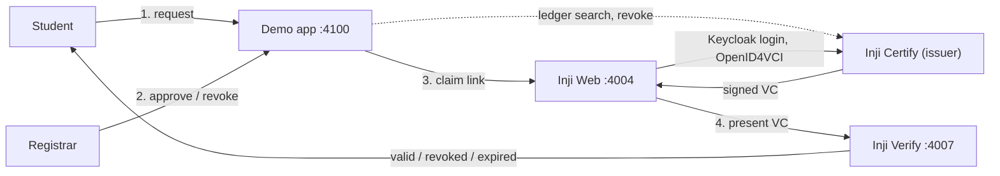
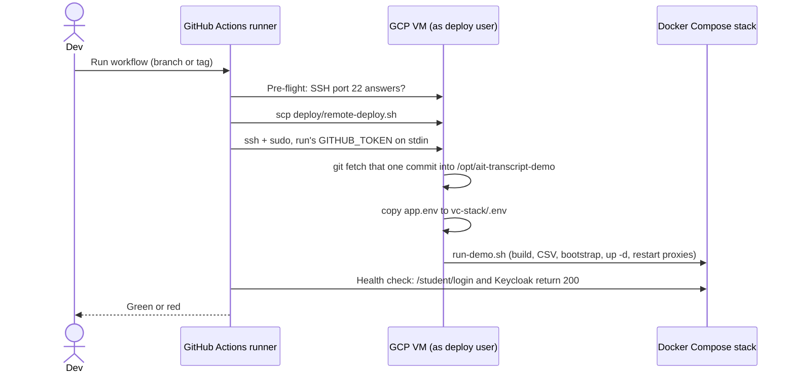

# AIT Transcript VC Journey

Local Docker-only walkthrough: student requests a transcript VC, registrar approves in the app, student claims into **Inji Web**, presents to **Inji Verify**.



Full service and port topology: [wiki/architecture/vc-stack.md](./wiki/architecture/vc-stack.md).

## Prerequisites

- Docker Desktop (Compose v2) — no host Python, `pip`, or `uvicorn`.
- `jq`, `curl`, `awk` on the host (used by the setup scripts, not just inside containers). `curl`/`awk` ship with macOS/Linux; `jq` may need `brew install jq`.
- **Windows:** run everything inside WSL2, not Git Bash — enable Docker Desktop's WSL integration, clone the repo into the WSL filesystem (not `/mnt/c/...`), and `sudo apt install jq` if it's missing. Git Bash mangles absolute paths in bind-mount arguments (e.g. the keystore step's `-v "$PWD/certs:/certs"`), which silently breaks the mount.

## Local development

### Start the stack

From the repo root:

```sh
chmod +x run-demo.sh vc-stack/bootstrap.sh vc-stack/smoke.sh
./run-demo.sh
```

This builds the demo app image, regenerates `vc-stack/config/student_identity_data.csv` from `data/students.json` (inside Docker), runs `./vc-stack/bootstrap.sh` (full stack + demo app), and leaves everything running.

**Docker-only equivalent** (after first `./run-demo.sh` has created `vc-stack/.env` and the external network):

```sh
mkdir -p .demo-state
docker compose -f vc-stack/docker-compose.yaml up -d --build
```

Use `./run-demo.sh` when you change `data/students.json` so Certify’s CSV stays in sync.

### Demo app persistence

Request/approval SQLite state lives at **`.demo-state/demo_requests.db`** on the host (bind-mounted into the container). It survives `docker compose restart demo-app` and `docker compose down` / `up`. Delete that file to reset workflow state.

### Developing the demo app

`app/` and `data/` are **bind-mounted** into the container; `uvicorn` runs with **`--reload`**, so Python and template edits apply without rebuilding. Rebuild only when `app/requirements.txt` changes:

```sh
docker compose -f vc-stack/docker-compose.yaml build demo-app
docker compose -f vc-stack/docker-compose.yaml up -d demo-app
```

The demo app calls Certify server-to-server (`ledger-search`, status list, revoke — see [wiki/concepts/vc-revocation.md](./wiki/concepts/vc-revocation.md)) but never Mimoto or Keycloak; for claiming and verifying it only renders links to **http://localhost:4004** and **http://localhost:4007** for the presenter’s browser.

## Local testing

Stack smoke (Inji services must be up):

```sh
./vc-stack/smoke.sh
```

Inji Web VC download readiness (config always; `--live` needs stack up — also run from `smoke.sh`):

```sh
python3 vc-stack/test_inji_web_vc_readiness.py
python3 vc-stack/test_inji_web_vc_readiness.py --live
```

Guards regressions that broke issuer list, Keycloak login, or same-origin token/download (`:4004` vs `:9099`). Full OAuth + PDF is still manual.

Demo app logic (host Python **or** inside the demo image):

```sh
python3 app/test_auth.py
python3 app/test_requests.py
```

```sh
docker compose -f vc-stack/docker-compose.yaml run --rm --no-deps demo-app python app/test_auth.py
docker compose -f vc-stack/docker-compose.yaml run --rm --no-deps demo-app python app/test_requests.py
```

Data fixture tests still need Python on the host (or run similarly via `demo-app`):

```sh
python3 data/test_ait_courses.py
python3 data/test_generate_csv.py
```

## Deploying to GCP

The demo also runs as a public deployment on a GCE VM behind Caddy (TLS), reachable without any local setup. The VM, DNS and firewall are defined in [mosip-asia/ait-vc](https://github.com/mosip-asia/ait-vc) (`ait-vc-transcript-demo/`); this repo only holds the app and the deploy workflow.

The VM is off outside Mon-Fri 08:30-18:30 Asia/Bangkok; the workflow's pre-flight says so if you deploy then.

### GCP infrastructure

Everything below is defined in Terraform in [mosip-asia/ait-vc](https://github.com/mosip-asia/ait-vc), not in this repo. Two roots are involved: `ait-vc-mgmt/terraform` (the project envelope and the DNS zone) and `ait-vc-transcript-demo/terraform` (the workload).

| GCP service | What it does here | Terraform |
|---|---|---|
| **Resource Manager, Billing** | Project `ait-vc-transcript-demo`, billing link, deletion lien. Only the Compute and IAM APIs are enabled. | `ait-vc-mgmt`: `prj-transcript-demo.tf` |
| **Compute Engine: VM** | One `e2-standard-2` (Debian 12, 30 GB `pd-balanced`, Shielded VM) in `asia-southeast1-b` running the whole Docker Compose stack. Its startup script installs Docker, Caddy and Dozzle and restarts the stack on every boot. | `compute.tf`, `startup.sh.tpl` |
| **Compute Engine: instance schedule** | Starts the VM 08:30 and stops it 18:30, Mon-Fri Asia/Bangkok, to save cost. | `schedule.tf` |
| **VPC, static IP, firewall** | A dedicated VPC and subnet, a permanent static external IP, and firewall rules for ports 80/443 (web), 22 (key-only SSH for GitHub runners) and 22 via IAP. Container ports stay closed. | `network.tf` |
| **Cloud DNS** | A records for the apex and `*.` wildcard pointing at the static IP, in the zone owned by `ait-vc-mgmt`. | `dns.tf` |
| **IAM, OS Login, IAP** | The VM's service account holds no roles. Operators listed in `admin_users` get OS Login admin and IAP tunnel access. | `compute.tf` |
| **Cloud Storage** | Holds the Terraform state (`gs://ait-vc-dpi-ait-ac-th-tfstate`). Not used at runtime. | `backends.tf` |

Not GCP services, but on the VM: **Caddy** terminates TLS (automatic Let's Encrypt certificates) and blocks the admin paths, and **Dozzle** shows container logs behind basic auth.

Change the VM, schedule, network or DNS by editing that Terraform in the `ait-vc` repo. A change to this repo's code never touches them; it only needs a [deploy](#deploy-a-change).

### Deploy a change

A deploy is manual and ships exactly one commit; nothing on the VM pulls code by itself.



1. Push your branch to GitHub (`mosip-asia/ait-transcript-demo`).
2. **Actions → Deploy → Run workflow**, choose the branch or tag.
3. The workflow logs in to the VM as `deploy`, runs `deploy/remote-deploy.sh` (fetch that commit into `/opt/ait-transcript-demo`, copy the VM's `app.env` to `vc-stack/.env`, run `run-demo.sh`), then health-checks `/student/login` and Keycloak's `openid-configuration`. Green means both returned 200.
4. Check the change on the [public URLs](#accessing-the-demo-on-gcp). Logs: Dozzle, or `docker logs <container>` over SSH.

## Accessing the demo locally

Keycloak admin console: **`http://localhost:9080/admin/`** (admin / admin). Inji Web student login uses **`http://localhost:9080`** (no `/etc/hosts` required).

### Local URLs

| Service | URL |
|---|---|
| Student portal | http://localhost:4100/student/login |
| Registrar portal | http://localhost:4100/registrar/login |
| Inji Web | http://localhost:4004 |
| Inji Verify | http://localhost:4007 |
| Keycloak admin | http://localhost:9080 (admin / admin) |

### Stakeholder walkthrough

After `./run-demo.sh` (no further terminal steps):

1. Open **http://localhost:4100/student/login** → pick a student → **Request my transcript VC**.
2. Open **http://localhost:4100/registrar/login** → approve that request.
3. Reload the student tab → use **Claim your credential** → Inji Web → AIT University → **AIT Transcript** → Keycloak login.
4. Download/open the credential PDF — layout must match `design/pdf-ait-transcript-template.html` (presenter visual check).
5. From the student portal, open **Inji Verify** → present the credential → verification succeeds.
6. Repeat with a second student persona.

## Accessing the demo on GCP

**Availability:** the VM runs **Mon-Fri 08:30-18:30 Asia/Bangkok** and is off otherwise, so outside those hours the URLs time out.

### Public URLs

| Service | URL |
|---|---|
| Student portal | https://transcript-demo.ait-vc.dpi.ait.ac.th/student/login |
| Registrar portal | https://transcript-demo.ait-vc.dpi.ait.ac.th/registrar/login |
| Inji Web | https://wallet.transcript-demo.ait-vc.dpi.ait.ac.th |
| Inji Verify | https://verify.transcript-demo.ait-vc.dpi.ait.ac.th |
| API gateway (Certify, Mimoto, Verify, Keycloak realms) | https://api.transcript-demo.ait-vc.dpi.ait.ac.th |
| Keycloak (student logins, realm `inji`) | https://keycloak.transcript-demo.ait-vc.dpi.ait.ac.th |
| Container logs (Dozzle, basic auth) | https://logs.transcript-demo.ait-vc.dpi.ait.ac.th |

## Docs

- [wiki/OVERVIEW.md](./wiki/OVERVIEW.md) — architecture and gotchas  
