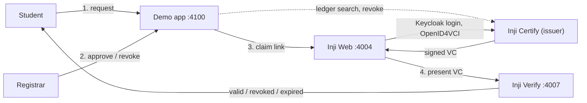

# AIT Transcript VC Journey Demo

Local Docker-only walkthrough: student requests a transcript VC, registrar approves in the demo app, student claims into **Inji Web**, presents to **Inji Verify**. Scope and acceptance criteria: [PRD.md](./PRD.md).



Full service and port topology: [wiki/architecture/vc-stack.md](./wiki/architecture/vc-stack.md).

## Prerequisites

- Docker Desktop (Compose v2) — no host Python, `pip`, or `uvicorn`.
- `jq`, `curl`, `awk` on the host (used by the setup scripts, not just inside containers). `curl`/`awk` ship with macOS/Linux; `jq` may need `brew install jq`.
- **Windows:** run everything inside WSL2, not Git Bash — enable Docker Desktop's WSL integration, clone the repo into the WSL filesystem (not `/mnt/c/...`), and `sudo apt install jq` if it's missing. Git Bash mangles absolute paths in bind-mount arguments (e.g. the keystore step's `-v "$PWD/certs:/certs"`), which silently breaks the mount.

Keycloak admin console: **`http://localhost:9080/admin/`** (admin / admin). Inji Web student login uses **`http://localhost:9080`** (no `/etc/hosts` required).

## One-command startup

From the repo root:

```sh
chmod +x run-demo.sh vc-stack/bootstrap.sh vc-stack/smoke.sh
./run-demo.sh
```

This builds the demo app image, regenerates `vc-stack/config/student_identity_data.csv` from `data/students.json` (inside Docker), runs `./vc-stack/bootstrap.sh` (full stack + demo app), and leaves everything running.

**Docker-only equivalent** (after first `./run-demo.sh` has created `vc-stack/.env` and the external network):

```sh
mkdir -p .demo-state
docker compose -f vc-stack/docker-compose.yaml up -d --build
```

Use `./run-demo.sh` when you change `data/students.json` so Certify’s CSV stays in sync.

### Demo app persistence

Request/approval SQLite state lives at **`.demo-state/demo_requests.db`** on the host (bind-mounted into the container). It survives `docker compose restart demo-app` and `docker compose down` / `up`. Delete that file to reset workflow state.

### Developing the demo app

`app/` and `data/` are **bind-mounted** into the container; `uvicorn` runs with **`--reload`**, so Python and template edits apply without rebuilding. Rebuild only when `app/requirements.txt` changes:

```sh
docker compose -f vc-stack/docker-compose.yaml build demo-app
docker compose -f vc-stack/docker-compose.yaml up -d demo-app
```

The demo app calls Certify server-to-server (`ledger-search`, status list, revoke — see [wiki/concepts/vc-revocation.md](./wiki/concepts/vc-revocation.md)) but never Mimoto or Keycloak; for claiming and verifying it only renders links to **http://localhost:4004** and **http://localhost:4007** for the presenter’s browser.

## URLs (this repo)

| Service | URL |
|---|---|
| Demo app — student | http://localhost:4100/student/login |
| Demo app — registrar | http://localhost:4100/registrar/login |
| Inji Web | http://localhost:4004 |
| Inji Verify | http://localhost:4007 |
| Keycloak admin | http://localhost:9080 (admin / admin) |

Mock student Keycloak login (after registrar approval in the demo app): username = student `id` from `data/students.json` (e.g. `ait-2026-0001`), password **`inji`**.

## Stakeholder walkthrough (PRD §9)

After `./run-demo.sh` (no further terminal steps):

1. Open **http://localhost:4100/student/login** → pick a student → **Request my transcript VC**.
2. Open **http://localhost:4100/registrar/login** → approve that request.
3. Reload the student tab → use **Claim your credential** → Inji Web → AIT University → **AIT Transcript** → Keycloak login.
4. Download/open the credential PDF — layout must match `design/pdf-ait-transcript-template.html` (presenter visual check).
5. From the student portal, open **Inji Verify** → present the credential → verification succeeds.
6. Repeat with a second student persona.

## Tests

Stack smoke (Inji services must be up):

```sh
./vc-stack/smoke.sh
```

Inji Web VC download readiness (config always; `--live` needs stack up — also run from `smoke.sh`):

```sh
python3 vc-stack/test_inji_web_vc_readiness.py
python3 vc-stack/test_inji_web_vc_readiness.py --live
```

Guards regressions that broke issuer list, Keycloak login, or same-origin token/download (`:4004` vs `:9099`). Full OAuth + PDF is still manual (PRD §9).

Demo app logic (host Python **or** inside the demo image):

```sh
python3 app/test_auth.py
python3 app/test_requests.py
```

```sh
docker compose -f vc-stack/docker-compose.yaml run --rm --no-deps demo-app python app/test_auth.py
docker compose -f vc-stack/docker-compose.yaml run --rm --no-deps demo-app python app/test_requests.py
```

Data fixture tests still need Python on the host (or run similarly via `demo-app`):

```sh
python3 data/test_ait_courses.py
python3 data/test_generate_csv.py
```

## Docs

- [wiki/OVERVIEW.md](./wiki/OVERVIEW.md) — architecture and gotchas  
