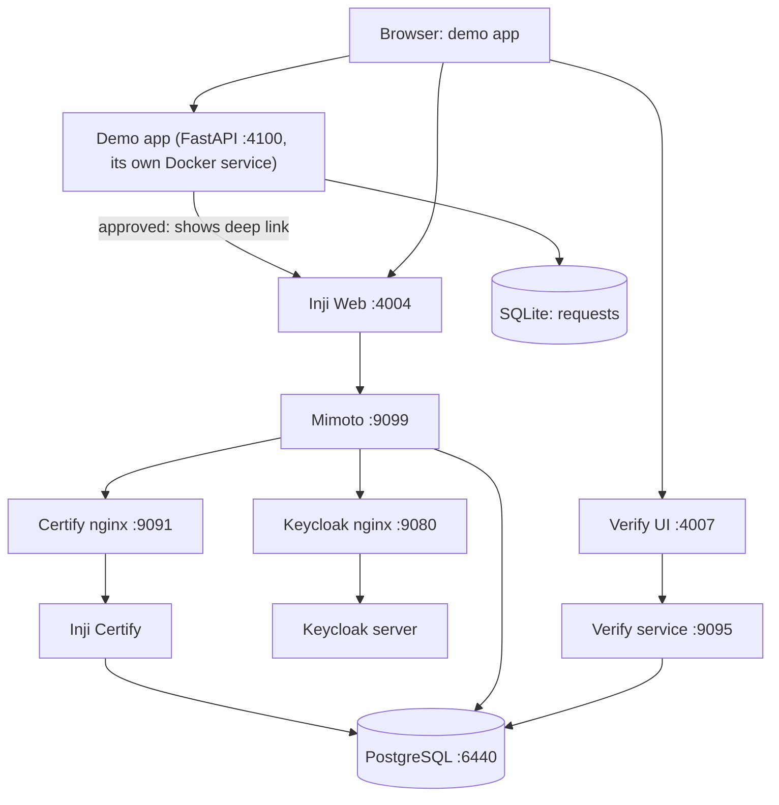

# Local Stack Architecture

`vc-stack/` in this repo vendors the same Docker Compose shape as `inji/vc-stack`, self-contained so this repo needs nothing else running. See [PRD.md §6.1.2](../../PRD.md) for the scope decision.

## Image versions

Pinned in [`vc-stack/docker-compose.yaml`](../../vc-stack/docker-compose.yaml) (the source of truth — update this table when you bump one):

| Component | Image |
|---|---|
| Inji Certify (with plugins) | `injistack/inji-certify-with-plugins:0.14.0` |
| Mimoto | `injistack/mimoto:0.21.0` |
| Inji Web | `injistack/inji-web:0.16.0` |
| Inji Verify service / UI | `injistack/inji-verify-service:0.17.0` / `injistack/inji-verify-ui:0.17.0` |
| Keycloak | `quay.io/keycloak/keycloak:24.0` |
| PostgreSQL | `postgres:15` |
| nginx (×3) | `nginx:stable` (floating tag) |

These are a known-working combination, and the `vc-stack/config/*.properties` files are tuned to them. Bump images together and re-check the config against the new releases' defaults. The demo app itself runs on `python:3.12-slim-bookworm`; its Python deps in `app/requirements.txt` are lower-bounded (`>=`), not pinned.

## Ports — deliberately not the `inji/vc-stack` defaults

Every host port here is `inji/vc-stack`'s default **+1000** (Postgres +1000 too: `5440` → `6440`), so this repo's stack can run **at the same time** as `inji/vc-stack` on the same machine without port collisions. The demo app itself uses `4100` — not `8000` (an extremely common dev-server default) and not `5000` (macOS AirPlay Receiver).

| Service | `inji/vc-stack` | This repo |
|---|---|---|
| Inji Web | 3004 | 4004 |
| Verify UI | 3007 | 4007 |
| Keycloak (nginx) | 8080 | 9080 |
| Certify (raw / nginx) | 8090 / 8091 | 9090 / 9091 |
| Verify service | 8095 | 9095 |
| Public gateway | 8098 | 9098 |
| Mimoto | 8099 | 9099 |
| PostgreSQL | 5440 | 6440 |
| Demo app | — | 4100 |

## What's the same as `inji/vc-stack`

Service topology, ports, and bootstrap approach: PostgreSQL, Inji Certify (+ nginx), Mimoto, Keycloak (+ nginx), Inji Web, Inji Verify (service + UI), public gateway.

**Keycloak (no `/etc/hosts`):** Browser OIDC uses `http://localhost:9080`, but Keycloak's `--hostname-url` and token `iss` are `http://keycloak:8080` (`KEYCLOAK_DOCKER_AUTH_SERVER`) — the internal Docker hostname, **not** the public URL. Mimoto 0.21's JWT client-assertion `aud` and Certify's `MOSIP_CERTIFY_AUTHN_ISSUER_URI` both have to match that `iss` exactly, so they use `KEYCLOAK_DOCKER_AUTH_SERVER` too, never `KEYCLOAK_PUBLIC_BASE_URL`. `keycloak-nginx.conf` is what makes the browser side work despite this: it rewrites only `authorization_endpoint` in the OIDC discovery JSON (`keycloak:8080` → `localhost:9080`) and, separately, rewrites `keycloak:8080` → `localhost:9080` in **HTML** responses (login page, required-actions pages) so self-referential links like the login form's `action` resolve for the browser — `token_endpoint` in the JSON path is deliberately left untouched. The **admin console** needs `--hostname-admin-url` matching `http://localhost:9080` (`KEYCLOAK_PUBLIC_BASE_URL`, this stack maps nginx **9080→8080**); without it, `/admin/` redirects to `http://localhost:8080/...`, which is not exposed on the host. Stock `inji/vc-stack` still documents `127.0.0.1 keycloak` because it publishes Keycloak on host **8080** with `keycloak:8080` URLs throughout, browser included — this repo's split (browser on `localhost:9080`, everything server-to-server on `keycloak:8080`) is what avoids that `/etc/hosts` requirement while still running alongside `inji/vc-stack` on the same machine.

- **Keycloak realm changes need a container *recreate*, not just a restart.** `keycloak-server` runs `start-dev --import-realm` with no persistent volume, but the dev-mode H2 database still lives in the container's writable layer, which a plain `docker compose restart keycloak-server` does **not** discard — so `--import-realm` sees the realm already exists and silently skips re-importing it, and an edited `keycloak-realm.json` (e.g. new seeded users) never takes effect. Confirmed live while adding Phase 7's per-degree Keycloak users: `restart` left the admin API showing only the old user list; `docker compose up -d --force-recreate keycloak-server` (fresh container, fresh writable layer) picked up the new ones. Always recreate, not restart, after editing `keycloak-realm.json`.
- **Nginx upstream DNS:** The Keycloak and Certify nginx containers resolve upstream hostnames once at start. If `keycloak-server` or `certify` is recreated, host `:9080`/`:9091` can return **502** until those nginx services restart. `bootstrap.sh` restarts `keycloak` and `certify-nginx` after every Mode B `docker compose up -d`. **Certify nginx** can also **exit completely** if it starts before the `certify` service is on Docker DNS (`host not found in upstream "certify"`); then Inji Web shows **no issuers** (502 on `/v1/mimoto/issuers`). Bootstrap waits for Certify `.well-known` on `:9091` and recreates `certify-nginx` before continuing. Both nginx configs also use **variable-based** `proxy_pass` (`set $upstream ...; proxy_pass http://$upstream...;`) for that deferred-DNS reason — variables disable nginx's normal location-prefix rewriting, which is a sharp edge in its own right, see [VC download troubleshooting](../guides/vc-download-troubleshooting.md#3-nginx-drops-the-path-suffix-same-404-different-cause).

## What's different

- **One credential type**: AIT Transcript only (see [Transcript credential design](../concepts/transcript-credential.md)) — no `StudentIDCredential`, no Credential Lab `lab-*` types.
- **Mock data source of truth**: `data/students.json` in this repo, not `inji/vc-stack/config/student_identity_data.csv` — the Certify CSV here is generated from that fixture, not hand-maintained.
- **Certify/Keycloak identity is per-degree, not per-student**: a student who holds both a Masters and a PhD is one `students.json` entry with `degrees: [...]`, but each degree gets its own CSV row / Keycloak user (`degree.keycloakId`) so it can be claimed as a distinct VC. The demo-app login/session is still per-student; only the claim-panel's "Keycloak username" is degree-specific.
- **New component**: the demo app (`app/`) sits in front of Inji Web/Verify with its own SQLite-backed request/approval state. It **is** a service in the same `docker-compose.yaml` (`PLAN.md` Phase 5) — not a separate host `uvicorn` process. A colleague picking up this repo should only ever need Docker. Through Phase 5 it made no server-to-server calls into the Inji stack (browser-only deep links); Phase 6 (registrar revoke/reissue, [VC revocation](../concepts/vc-revocation.md)) added its first ones, so it now joins `vc_stack_network` too.
- **Docker network name:** `vc_stack_network` (separate from `inji/vc-stack`'s `mosip_network` so both stacks can coexist without sharing the same external network object).
- **Certify nginx on restart:** `certify-nginx` proxies to the `certify` service. Stock nginx resolves upstream hostnames at **startup**; after a plain `docker compose restart`, `certify` may not be on Docker DNS yet and nginx exits (`host not found in upstream "certify"`) → empty issuers / `:4004` 502. This repo uses Docker’s embedded resolver (`127.0.0.11`) and variable `proxy_pass` in `certify-nginx.conf` and `public-gateway-nginx.conf` so nginx starts reliably; `bootstrap.sh` still waits for `:9091` before declaring health.
- **Inji Web → Mimoto:** set `MIMOTO_URL=http://localhost:4004/v1/mimoto` so the browser uses the inji-web nginx proxy (same origin). Pointing Mimoto at `localhost:9099` directly causes CORS failures and an empty issuer list. **`mimoto-issuers-config.json` `token_endpoint` must also use `:4004`** (via `LOCAL_MIMOTO_PUBLIC_BASE_URL` in `bootstrap.sh`), not `:9099`, or OAuth completes but VC download fails with “session is not valid or session is completed”. **`mosip.security.origins` in `mimoto-default.properties` must be `http://localhost:4004`** (not `3004`) so Mimoto accepts the browser `Origin` on proxied POSTs; wrong origin → HTTP 403 and the same Inji Web “invalid session” message. For **download after Keycloak login**, `mimoto-issuers-config.json`'s `authorization_audience` and `proxy_token_endpoint` are both `http://keycloak:8080/realms/inji/protocol/openid-connect/token` — informational fields Mimoto 0.21 exposes on its APIs but does **not** actually use for the token exchange (`IdpServiceImpl.getTokenResponse` uses the auth-server well-known's `token_endpoint` instead, which is why that value has to match too — see the Keycloak paragraph above). Set **`redirect_uri`** to `http://localhost:4004/redirect` for Inji Web.
- **Mimoto → Certify well-known:** `mimoto-issuers-config.json` uses `http://host.docker.internal:9091/...` with `extra_hosts: host.docker.internal:host-gateway` on `mimoto-service`, because Mimoto fetches issuer metadata from inside the container.
- **JSON-LD context URL:** seeded as `http://host.docker.internal:9091/academic-transcript-context.json` so verify-service (Docker) can resolve it; served from `vc-stack/config/academic-transcript-context.json` via certify-nginx.
- **Inji Web → Keycloak login:** Mimoto’s `/issuers/{id}/configuration` must expose a **browser-reachable** `authorization_endpoint` (`http://localhost:9080/...`). Set `keycloak.external.url=http://localhost:9080` and `keycloak.internal.url=http://keycloak:8080` in `mimoto-default.properties`. Certify’s OID4VCI **`authorization_servers`** must list a **Docker-reachable** realm URL (`MOSIP_CERTIFY_AUTHORIZATION_URL=http://keycloak:8080/realms/inji`) so Mimoto can fetch auth-server well-known from inside the container — do **not** put `http://localhost:9080` there (+1000 port map); Mimoto’s `localhost` is not the host. **JWT `aud` for VC download** comes from **`authorization_audience`** in `mimoto-issuers-config.json` (`http://localhost:9080/.../token`), not from `authorization_servers`. Add `http://localhost:4004/redirect` to Keycloak `wallet-demo` redirect URIs. **`keycloak-nginx.conf` uses runtime DNS** (same pattern as certify-nginx) so `keycloak:8080` keeps working after container recreate — otherwise `/configuration` fails (`RESIDENT-APP-042`, well-known not accessible) and Inji Web shows **“No Credentials found”** after tapping the issuer.

## Related

- [PRD.md](../../PRD.md)
- [Approval gate](../concepts/approval-gate.md)
- `inji/wiki/architecture/local-sandbox.md` (the pattern this mirrors)
