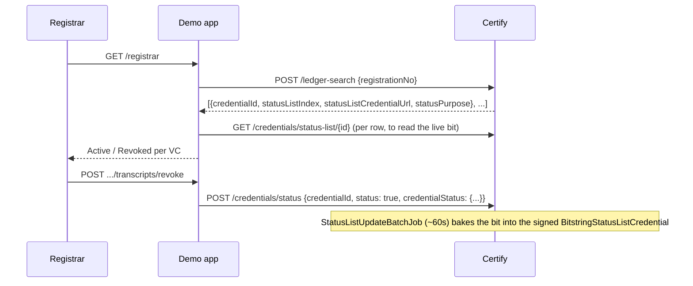

# VC Revocation

Registrar can revoke an issued transcript, issue a replacement, and see a student's full VC history. This was the demo app's **first server-to-server integration with Certify**; every earlier phase only ever handed the *browser* deep links to Inji Web/Verify (see [Local stack](../architecture/vc-stack.md)).

## Design: no duplicate state

Certify already tracks every issued VC in its own ledger (`certify.ledger`, `certify.status_list_credential`, `certify.credential_status_transaction` — see `vc-stack/certify_init.sql`). The demo app does **not** keep its own copy of "which VCs exist" — [app/certify_client.py](../../app/certify_client.py) queries Certify's `/ledger-search` live on every registrar page load. The app's own SQLite `requests` table stays scoped to what it already owned before this phase: the pre-issuance approval cycle (now append-only history, so a student can go through request → approve → claim more than once — [app/requests.py](../../app/requests.py)).

Ledger rows are indexed by **claim values**, not the app's own `student_id` (`ait-2026-0001`-style). The AIT Transcript's indexed identifier is `registrationNo` (`st125001`-style) — `certify_client.py` translates via `fixtures.get_student(student_id)["registrationNo"]` before every Certify call.



## Reissue gating

Registrar can only start a new request cycle for a student if `certify_client.get_active_credential(registration_no)` returns `None` — no non-revoked VC on the ledger. This is a **registrar-initiated** one-step action (`create_request` + `approve_request` together, `POST /registrar/students/{id}/reissue`), not the student re-requesting — the requirement was phrased as something the registrar drives directly.

## The VCDM 1.1 → 2.0 migration (the real fix)

`credential_status_purpose = ARRAY['revocation']` was already set on the AIT Transcript credential config, and `mosip.certify.issuer.ledger-enabled=true` was already on — but no VC ever actually carried a `credentialStatus` claim, and `certify.status_list_credential`/`credential_status_transaction` were both empty. Confirmed by reading `inji-certify`'s actual source (`CertifyIssuanceServiceImpl.java`, `VCDM2Constants.java`), not just its config: Certify only calls `statusListCredentialService.addCredentialStatus(...)` when the credential request's `@context` contains `VCDM2Constants.URL = "https://www.w3.org/ns/credentials/v2"`. The AIT Transcript was VCDM 1.1 end-to-end (`https://www.w3.org/2018/credentials/v1`).

Three changes, all in `vc-stack/certify_init.sql`:

| Change | Where | Detail |
|---|---|---|
| `@context` | `credential_config.context` **and** the vc_template's own `@context` | `.../2018/credentials/v1` → `https://www.w3.org/ns/credentials/v2`. Both must match — Certify's `isValidLdpVCRequest` requires the wallet's requested context list and the stored config's to agree by size + content (`new HashSet<>(stored).containsAll(request)`, with an early-out on size mismatch). |
| Property names | vc_template | `issuanceDate`/`expirationDate` → `validFrom`/`validUntil` (VCDM2 renamed these; `credentialSubject` is untouched). |
| `credentialStatus` block | vc_template, sibling to `credentialSubject` | Hand-built with **dot-notation**, not a bare substitution: |

```json
"credentialStatus": {
  "id": "${credentialStatus.id}",
  "type": "${credentialStatus.type}",
  "statusPurpose": "${credentialStatus.statusPurpose}",
  "statusListIndex": "${credentialStatus.statusListIndex}",
  "statusListCredential": "${credentialStatus.statusListCredential}"
}
```

A bare `"credentialStatus": ${credentialStatus}` (matching the unquoted-embed pattern already used for `"courses": ${courses}`) does **not** work — Velocity's `${var}` calls `.toString()` when the reference isn't dereferenced further, and for a `Map` that produces Java syntax (`{type=BitstringStatusListEntry, statusListIndex=5, ...}`), not JSON. It silently corrupts the rendered credential (`org.json.JSONException: Expected a ',' or '}' at ...`, pointing at the `credentialStatus` line) rather than failing to resolve — easy to misread as "the field doesn't exist" when it's actually "the field exists but you embedded the whole object instead of its fields."

## Gotchas already hit — do not re-discover

- **Unrelated schema-drift bug, found only because revocation was finally exercised**: `certify.status_list_credential` had a column named `capacity`; the running `injistack/inji-certify-with-plugins:0.14.0` image's entity expects `capacity_in_kb`. Pure DDL vendoring drift — the table existed and looked complete, but nothing had ever actually written to it before this phase. Fixed by renaming the column in `certify_init.sql`. If you see `ERROR: column slc1_0.capacity_in_kb does not exist`, this is why — and check the *other* status/ledger tables' column names against the entity classes too if it recurs (`StatusListAvailableIndices`, `CredentialStatusTransaction`, `Ledger` all matched exactly when checked here, only `StatusListCredential` had drifted).
- **`demo-app` wasn't on the Inji network at all.** It was deliberately left off `vc_stack_network` (see [Local stack](../architecture/vc-stack.md)) back when the app only ever handed the browser deep links. Revocation is the first feature needing a real server-to-server call, so `vc-stack/docker-compose.yaml`'s `demo-app` service now has `networks: [network]` too. Forgetting this produces `could not resolve issuer DID: [Errno -2] Name or service not known` — a DNS failure, not an auth or config failure.
- **Mimoto caches issuer/credential-config metadata in memory.** After changing anything in `credential_config` (context, vc_template), restart `certify` *and* `mimoto-service`. Restarting only `certify` leaves the wallet getting `No matching ldp_vc credential configuration found for scope: ait_transcript_vc_ldp` even though Certify itself already has the fix — Mimoto is still handing out the stale discovery document it cached before the change.
- **`/ledger-search` returns HTTP 204 with an empty body for a student with zero issued VCs** — not `200 []`. `resp.json()` on an empty body raises `json.decoder.JSONDecodeError: Expecting value`. `certify_client.list_credentials` checks `resp.content` before calling `.json()`.
- **Status-list updates are asynchronous, on a fixed ~60s schedule** (`StatusListUpdateBatchJob`, logs "Starting status list update batch job" every minute). A revoke call returns 200 immediately (it just inserts a `credential_status_transaction` row), but the actual signed `BitstringStatusListCredential` — the thing any verifier reads — doesn't flip until the next batch run. The registrar UI says so; don't expect an instant status change.
- **VCs issued before this fix can never be revoked** — they have no `credentialStatus` claim at all, so there's no status-list bit to flip. The registrar UI detects this (`statusListCredentialUrl`/`statusListIndex` both absent) and labels them "not revocable (issued before revocation was enabled)" instead of offering a Revoke button that would 500. If every one of a student's VCs happens to be pre-fix, their "Issue new transcript" stays permanently disabled — that's correct given the ledger's actual history, not a bug, but worth knowing if test data from before this phase is still lying around.
- **Don't trust the ledger response fields alone as proof revocation works.** `statusListCredentialUrl`/`statusListIndex`/`statusPurpose` being present just means Certify *thinks* it attached status. The only real proof is decoding the actual signed status list: `GET /credentials/status-list/{id}`, take `credentialSubject.encodedList` (multibase `u` prefix = base64url, then gzip-compressed), and check the bit at `statusListIndex` (MSB-first within each byte, per the [Bitstring Status List spec](https://www.w3.org/TR/vc-bitstring-status-list/)). `certify_client._bitstring_bit()` does exactly this — it's how the fix above was actually confirmed, not just assumed from a 200 response.

## Related

- [Local stack](../architecture/vc-stack.md) — network topology `demo-app` joined
- [Transcript credential design](./transcript-credential.md) — the vc_template these changes live in
- [VC download troubleshooting](../guides/vc-download-troubleshooting.md) — same "read the actual source/bytecode, don't guess from config" method used to find the VCDM2 requirement
