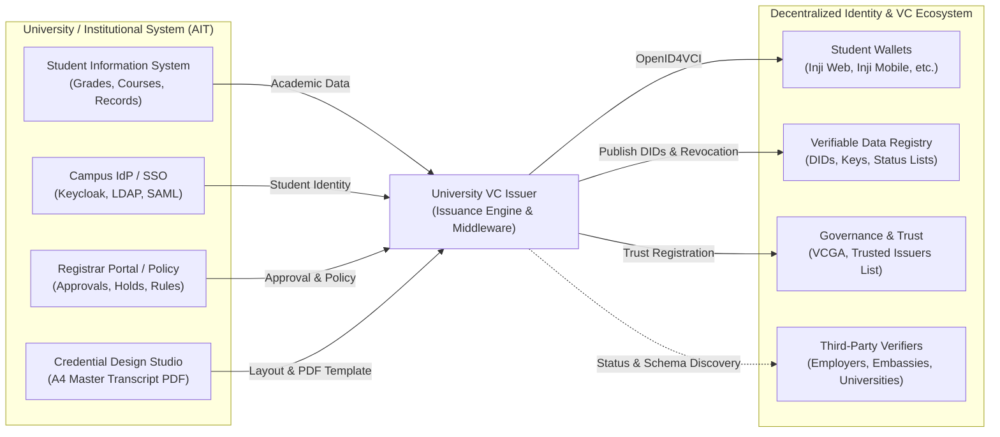
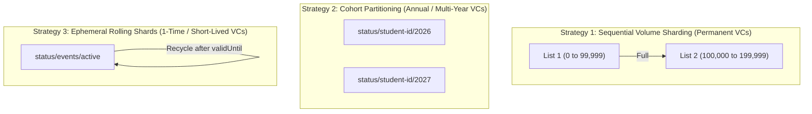
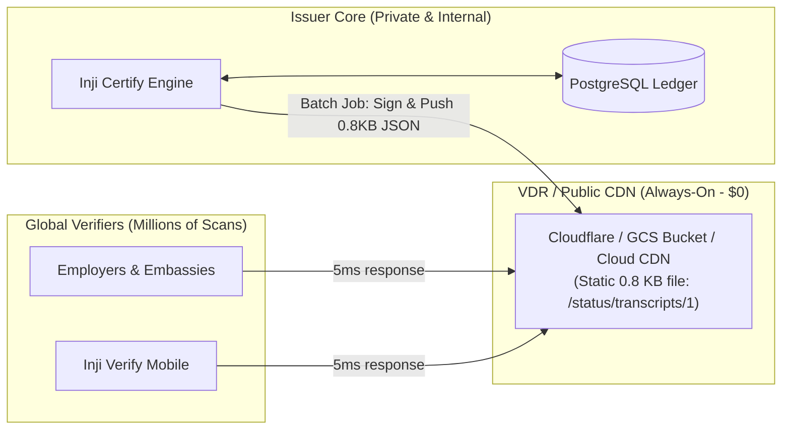

# University VC Issuer Foundation: The Role & Functionality of a Complete Issuer

> [!IMPORTANT]
> **Foundational Starting Point**: This document is the conceptual foundation of the entire project. All developers, integrators, and stakeholders must understand the dual-boundary role of a complete university issuer before proceeding to specific institutional scopes or implementation milestones.

## 1. Overview: The Issuer as an Interoperability Bridge

To issue digital academic transcripts as Verifiable Credentials (VCs), a university cannot simply rely on a standalone web form or a generic PDF generator. A **complete, interoperable University VC Issuer** acts as a secure bridge connecting two fundamentally different architectural environments:

By decoupling and clearly defining these two integration boundaries, a university can upgrade its internal student records and registrar systems independently from the evolving standards of the decentralized identity ecosystem.

---

## 2. Integration Boundary 1: Decentralized Identity & VC Ecosystem

This boundary governs how the university interacts with standard digital identity components, international credential standards, and third-party systems.

### 2.1 Student Wallets (OpenID4VCI)
- **Standard Protocol**: Support **OpenID for Verifiable Credential Issuance (OpenID4VCI)** so students can claim their credentials using any compliant digital wallet (e.g. Inji Web, Inji Mobile, Apple Wallet, Lissi).
- **Issuance Flows**: Support both **Authorization Code Flow** (student logs in via wallet browser redirect) and **Pre-Authorized Code Flow** (one-click claim via QR code or secure email/SMS link).
- **Credential Offer & Metadata Discovery**: Expose standard `.well-known/openid-credential-issuer` metadata detailing supported credential formats, cryptographic suites, and claim display properties.

### 2.2 Verifiable Data Registry (VDR)
- **Decentralized Identifier (DID) Management**: Maintain an institutional signing identity via standard DID methods (e.g., `did:web` for domain-linked discovery or `did:key` for sandbox environments).
- **Key Rotation & Proofs**: Generate and manage cryptographic key pairs for signing credentials (e.g., Ed25519, ECDSA, RSA) conforming to W3C Linked Data Signatures or JOSE/COSE.
- **Revocation & Status Lists**: Host privacy-preserving status mechanisms (such as **W3C Bitstring Status List 2021/2026** or Token Status List) on the VDR, allowing verifiers to confirm revocation status without tracking individual students.

### 2.3 Verifiable Credential Governance Authority (VCGA) & Trust Frameworks
- **Accreditation & Registry**: Register the university as an authorized academic issuer within national, regional, or consortium Trust Registries / Trusted Issuers Lists (TIL).
- **Governance Compliance**: Comply with ecosystem trust policies (e.g., MOSIP Identity Trust Framework, EBSI, eIDAS 2.0, or national higher-education accreditation councils).
- **Schema Governance**: Publish and adhere to globally recognized schema definitions so verifiers can parse academic records deterministically.

### 2.4 Third-Party Verifiers
- **Standard Payload Formats**: Emit credentials conforming to **W3C Verifiable Credentials Data Model (VCDM 1.1 / 2.0)**, JSON-LD contexts, or SD-JWT VC (Selective Disclosure).
- **Public Schema Discovery**: Provide publicly resolvable credential schemas and contexts so verifying organizations (employers, foreign universities, embassies) can validate syntax and semantics.

---

## 3. Integration Boundary 2: University & Institutional Systems

This boundary connects the issuer engine to the university's internal records, administrative personnel, and institutional identity infrastructure.

### 3.1 Identity & Access Management (Campus IdP / SSO)
- **Subject Authentication**: Authenticate the student requesting the transcript via the university's identity provider (Keycloak, Shibboleth, Active Directory/LDAP, SAML 2.0, or OpenID Connect).
- **Identity Binding**: Ensure the authenticated campus user matches the academic record being issued and cryptographically bind the credential to the student's wallet public key (Holder Binding).
- **Zero-Touch Authentication Scaling (Face Scanning, Biometrics, MFA)**: Because Inji Certify relies strictly on standard OIDC/OAuth 2.0 token validation, advanced authentication requirements—such as facial biometric verification, photo liveness checks, hardware tokens, or multi-factor authentication—are handled entirely within the campus IdP (`auth.transcript.ait.ac.th`). Inji Certify requires zero custom code or recompilation to support new authentication factors.

### 3.2 Student Information System (SIS / ERP)
- **Authoritative Data Extraction**: Connect directly to the university's system of record (e.g., Banner, PeopleSoft, SAP, or custom institutional databases) to extract canonical student and course data.
- **Transcript Data Aggregation**: Assemble complete semester histories, course codes, course titles, credit values, letter grades, semester GPAs, cumulative GPAs, thesis committee information, and degree conferral details.
- **Data Ingestion Channels**: Support real-time API integrations, secure batch imports (CSV/JSON), and event-driven webhooks for graduation events.

### 3.3 Registrar Workflows & Institutional Governance
- **Approval Gate & Policy Enforcement**: Enforce institutional rules prior to issuance:
  - Financial clearance (tuition/library hold checks).
  - Registrar review and explicit manual sign-off when required.
  - Automated issuance rules upon graduation senate approval.
- **Credential Lifecycle & Audit Logging**: Maintain an immutable registrar audit trail tracking who requested, approved, issued, re-issued, or revoked a credential.
- **Revocation Triggers**: Provide registrar interfaces to revoke or suspend credentials (e.g., following retroactive grade changes, academic disciplinary actions, or administrative corrections).

### 3.4 Visual Rendering & Physical Transcript Fidelity
- **Printable Master Transcript Template**: Generate high-fidelity rendering artifacts (such as an A4 Master Transcript PDF using Mimoto/Velocity or HTML-to-PDF engines) matching the official physical paper transcript.
- **Embedded Verification QR Code**: Render verification deep links or encoded presentation requests on the PDF layout so printed paper copies can also be cryptographically verified.
- **Verification QR vs. Issuance QR Separation**: The QR code printed on the physical A4 PDF is strictly a **Verification QR** (read-only tamper-proofing for third-party verifiers to check AIT's cryptographic signature and Bitstring revocation status). It is **not** an issuance QR and cannot be scanned to import a holder-bound credential into a wallet. Physical copies remain physical. Issuance into a wallet occurs strictly via an interactive OpenID4VCI exchange initiated on the portal screen.
- **Wallet Card Display**: Provide human-friendly card styling (institution logo, background colors, summary claims) for in-wallet visualization.

---

## 4. Summary: The Complete Issuer Capability Matrix

| Capability Area | VC Ecosystem Facing (Boundary 1) | University Campus Facing (Boundary 2) |
|---|---|---|
| **Identity & Authentication** | Holder key binding, wallet DID negotiation | Campus SSO / Keycloak / LDAP student login |
| **Protocol & Transport** | OpenID4VCI endpoints (`/credential`, `/token`) | Internal REST APIs, event queues, CSV ingestion |
| **Data & Claims** | W3C VCDM 2.0 / JSON-LD / SD-JWT schemas | SIS database queries, course catalog models |
| **Governance & Approval** | VCGA registration, Trusted Issuers List (TIL) | Registrar approval dashboard, graduation holds |
| **Revocation & Status** | Bitstring Status List hosted on VDR / web | Registrar revoke/reissue action in student registry |
| **Visual Presentation** | Wallet card metadata & display schemas | Official AIT Master Transcript A4 PDF template |

---

## 5. Architectural Design Principles: The "Issuer in a Box"

To satisfy both the enterprise cryptographic requirements of Inji Certify and modern cloud-native operational standards, the project implements the **"Issuer in a Box"** architectural pattern:

### 5.1 Core Architectural Principles & Component Boundaries

1. **Edge Ingress & Automated SSL (Traefik / Caddy)**:
   - Binds to host ports `80` and `443` on the VM.
   - Terminates public HTTPS and automatically issues/renews **Let's Encrypt TLS certificates** for all subdomains (`api.*`, `wallet.*`, `verify.*`, `transcript-demo.*`).
   - Forwards traffic to internal Docker services over plain HTTP, eliminating the need to manage complex Java keystores (`.jks`) inside containers.
   - Protects internal endpoints by blocking `/admin` and `/actuator` paths from the public internet.

2. **Inji Certify as the Pure VC Generation & Signing Solution**:
   - Runs Spring Boot with an embedded Apache Tomcat web server (listening on internal HTTP `:8090`).
   - **Owns 100% of OpenID4VCI**: Student wallets communicate directly with Certify through the edge proxy for all protocol endpoints (`/.well-known/...`, `/token`, `/credential`).
   - **Pure VC Generation & Cryptographic Engine**: Inji Certify is relieved of all user authentication and identity verification responsibilities. It strictly verifies signed OIDC tokens against the campus IdP's JWKS and signs W3C Verifiable Credentials.
   - **Zero Recompilation for Authentication Upgrades**: When adding multi-factor authentication (MFA), biometric face scanning, or photo liveness checks, **zero code changes or redeployments** are required in Inji Certify.
   - **No Custom Proxying**: No external web server proxies or re-implements OpenID4VCI token validation, proof-of-possession, or W3C VC signing.
   - **Stateless Operation**: Holds zero user sessions and sets zero cookies.

3. **Stateless University Integration via REST Adapter (`rest.transcript.ait.ac.th`)**:
   - Instead of coupling Inji Certify directly to legacy campus databases or custom Java plugins, Certify invokes an external, standard **REST Data Provider** (`GET /students/{id}/transcript`).
   - A lightweight **AIT SIS Adapter Middleware** acts as an Anti-Corruption Layer, translating AIT’s internal SIS tables or databases into the clean JSON payload expected by Inji Certify.
   - **Zero Redundant Data Storage**: Inji Certify stores no student grades, transcripts, or GPAs. Academic records are fetched on-demand at the exact second of issuance, keeping Certify completely stateless.
   - **Multi-Credential & Multi-Device Governance**:
     - *Multiple Qualifications (Master's + Ph.D.)*: Treated as distinct credentials (`degreeId`), each with its own independent status list bit and lifecycle.
     - *Multi-Device Wallets (Phone + Laptop)*: Supported concurrently via distinct holder DIDs (`_holderId = did:key:...`).
     - *Duplicate Prevention*: Idempotency checks and pre-issuance gating prevent duplicate active credentials within the same wallet.

4. **Pre-Issuance Workflow Portal (AIT Web App)**:
   - A lightweight web application (e.g. FastAPI / React) serving strictly as the **human workflow portal**.
   - Allows students to log in, view their academic profile, and request an official transcript.
   - Allows academic registrars to review pending requests, check financial/academic holds, and approve issuance.
   - Once approved, the record is flagged in the system so Certify's `DataProviderPlugin` can issue the credential when the student opens their wallet. Does **not** speak OpenID4VCI to wallets.

### 5.2 Zero-Idle Compute: VM Suspend / Hibernation over Shutdown

> [!NOTE]
> **Interim Solution for 2026 (Optimization Deadline: Q3 2027)**: 
> VM Suspend / Hibernation is an **interim operational pattern** adopted for the 2026 milestone to avoid the heavy cold-boot penalty of Java Spring Boot while reusing Inji Certify off-the-shelf. 
> 
> This component **must be further optimized before Q3 2027**—with the planned roadmap targeting a transition from the hibernating VM to a truly stateless, serverless Cloud Run microservice (e.g. lightweight Node.js/Python converter) that eliminates the VM footprint entirely.

- **The Problem**: Java Spring Boot cold starts can take 20–30 seconds if the VM is shut down completely.
- **The Solution**: Use **Google Cloud VM Suspend & Resume (`gcloud compute instances suspend/resume`)**.
  - **$0 Compute Billing**: When suspended, vCPU and RAM billing completely stops (only paying pennies for disk and the frozen RAM storage image).
  - **Instant 10-Second Warm Resume**: Resumes the frozen memory image directly into RAM with the JVM and connection pools already hot, eliminating cold-start delays.
  - **Wakeup Orchestration**: Triggered on-demand via the always-active Gateway or automated schedule.

### 5.3 PostgreSQL as an Operational Revocation & Lifecycle Ledger
- Inji Certify’s Java codebase requires a relational database connection at boot to manage Bitstring Status Lists, cryptographic key aliases, and the audit ledger (`certify.ledger`).
- **Mental Model Shift**: PostgreSQL is **not** the enterprise system of record for student grades; it functions as the **cryptographic lifecycle memory and revocation ledger** for Certify (storing bitstrings, index allocations, and credential status).
- **Two-Phase Architecture Trajectory**:
  - **Phase 1 (2026 Milestone - Low-Cost "Issuer in a Box")**:
    PostgreSQL is co-located as a Docker container on the VM's persistent disk. This eliminates the ~$55/month cost of a 24/7 Google Cloud SQL instance while freezing and waking seamlessly alongside Certify at $0 compute cost.
  - **Phase 2 (Future Scale / Q3 2027 Optimization - Externalized Shared Database)**:
    When migrating Inji Certify to stateless, serverless Cloud Run microservices, PostgreSQL is **moved out of the issuer box** into an external, managed cloud database (Google Cloud SQL or central campus PostgreSQL). This enables:
    1. **Stateless Autoscaling**: Multiple compute workers can scale out horizontally during graduation rushes, querying a single shared ledger.
    2. **Multi-Department / Multi-Issuer Reuse**: Other AIT schools (School of Management, School of Engineering, Extension certificates) can reuse the same central database cluster.
    3. **Institutional Longevity**: The database—which holds the permanent lifecycle state of all university credentials—lives independently of any ephemeral compute instance.

---

## 6. Data Resilience & Disaster Recovery Strategy

In decentralized identity, if an Issuer loses its database of which student was assigned which status list index (`student_id <-> statusListIndex`), it suffers from **"Lost Control" (Orphaned VCs)**—credentials remain valid in the wild on public VDRs, but the university can never revoke them.

To guarantee that the university never loses control of issued credentials, the architecture enforces a **4-Tier Resilience & Backup Strategy**:

| Tier | Backup Layer | Mechanism | Purpose | Environments | Cost Profile |
|---|---|---|---|---|---|
| **Tier 1** | **Hot Local Persistence** | GCP Persistent Disk volume (`pd-balanced`) | Operational continuity across container restarts, reboots, and VM hibernation | **Dev, Staging, Production** | Included in base VM disk ($0 extra) |
| **Tier 1.5** | **Fast-Rollback VM Snapshots** | Automated GCP Disk Snapshot (7-day rolling window) | Ultra-fast recovery (RTO < 5 min) from bad deployments or OS update failures | **Production Only** | Pennies (7-day differential disk) |
| **Tier 2** | **Warm Logical Cloud Backup** | Clean, portable `pg_dump` $\rightarrow$ **GCS Bucket** (30-day retention + versioning) | True disaster recovery: restores clean database if VM or disk is destroyed | **Staging, Production** | Low (< $1/month) |
| **Tier 3** | **Cold Annual Archive** | Annual academic-year freeze $\rightarrow$ **Separate Multi-Region GCS / On-prem** (WORM locked) | Permanent (50+ year) regulatory retention for academic degrees | **Production Only** | Negligible (Cold Archive tier) |

---

## 7. Project Navigation & Milestones

The documents in this section build directly upon this architectural foundation:

- **[Project Scope & Objectives](./scope.md)**: Establishes the 3 foundational pillars (Data Model, Data Sources, Business Policies) and maps them to the Asian Institute of Technology (AIT).
- **[Milestone (2026): AIT Institutional Integration](./milestone-2026-ait-integration.md)**: First milestone focusing on **Integration Boundary 2 with AIT** (transcript schema, registrar approval gate, revocation, and print-accurate A4 PDF styling).

---

## Appendix: Bitstring Capacity Planning, Partitioning & Lifecycle Strategies for Future VCs

When expanding the university issuer to new credential types (such as Student ID Cards, Alumni Badges, Library Passes, or Single-Use Event Tokens), architects must make intentional design choices regarding **capacity sizing, dataset separation, and bit recycling**.

### A.1 The Capacity Decision Framework: How Many VCs Will the System Hold?

Before minting any new credential type, answer two questions:
1. **Concurrency & Velocity**: How many active credentials will exist simultaneously, and how frequently are they issued/revoked?
2. **Lifespan**: Is the credential **Permanent** (Transcripts, Diplomas) or **Ephemeral / 1-Time** (Student IDs, Event Badges, Temporary Visitor Passes)?

#### Bitstring Size vs. Network Payload (Gzip Compression)
Because unrevoked bitstrings consist almost entirely of binary `0`s, modern HTTP compression (Gzip/Brotli) achieves ~99% compression ratios over the wire:

| Bitstring Allocation | Raw Uncompressed | Compressed Wire Size (Gzip) | Ideal Use Case |
|---|---|---|---|
| **100,000 bits** | 12.5 KB | **~0.8 KB** | High-Education Diplomas / Transcripts (50–100 years of cohorts) |
| **1,000,000 bits** | 125 KB | **~2.5 KB** | Multi-campus Student IDs / Active Staff Cards / Regional Consortia |
| **10,000,000 bits** | 1.25 MB | **~25 KB** | National Identity / Nationwide High-Volume Single-Use Badges |

Even a 1-million-bit status list downloads across 4G/5G mobile networks in **under 20 milliseconds**, making size concerns negligible for verifiers.

---

### A.2 The 3 Partitioning & Sharding Strategies

Depending on credential volatility, use one of three partitioning models:

#### Strategy 1: Sequential Volume Sharding (Transcripts & Diplomas)
- **Model**: `status/transcripts/1` $\rightarrow$ `status/transcripts/2` $\rightarrow$ `status/transcripts/N`.
- **Behavior**: Cumulative and immutable. When List 1 reaches ~95% capacity, Inji Certify begins issuing new credentials into List 2.
- **Recycling**: **Zero bit recycling**. Past indices remain permanently associated with their original graduates.

#### Strategy 2: Cohort Partitioning (Student IDs & Campus Access)
- **Model**: `status/student-id/2026`, `status/student-id/2027`.
- **Behavior**: Scoped to an academic intake or validity year.
- **Retirement**: When the Class of 2026 reaches its graduation expiration date, the entire 2026 list is retired. Verifiers reject expired credentials on date checks alone without querying the bitstring.

#### Strategy 3: Ephemeral Rolling Shards (1-Time Passes & Event Badges)
- **Model**: Fixed-size rolling list (e.g. 50,000 bits) for temporary single-use or daily credentials.
- **Behavior**: Used for campus visitor passes, exam admissions, or library day-access.

---

### A.3 Bitstring Index Recycling: The Golden Rules

Can a revoked or expired bit index be recycled and reassigned to a new student?

> [!CAUTION]
> **The Golden Rule of Bit Recycling**:  
> A bit index must **NEVER** be recycled while the previous credential can still be presented in the wild.
> 
> *Why?* If Student A's bit #42 was revoked (`bit 42 = 1`), and you reset bit #42 back to `0` to assign it to Student B:
> 1. If Student A attempts to present their old card, it will falsely appear **VALID**!
> 2. Conversely, if Student A is revoked later, Student B's valid card will be accidentally revoked!

#### When Recycling IS Permitted:
Bit recycling is **safe only after the credential's `validUntil` expiration date has elapsed**:
1. Every ephemeral or 1-time VC must include a strict `validUntil` timestamp (e.g., `validUntil: "2026-10-04T00:00:00Z"`).
2. Once that timestamp passes, compliant verifiers immediately reject the credential based on timestamp math, without ever consulting the bitstring.
3. Only after the `validUntil` buffer has cleared may Inji Certify safely return that bit index to the `status_list_available_indices` pool for reuse.

---

### A.4 Architectural Decision Matrix for Future Institutional VCs

| Credential Type | Intended Lifespan | Recommended Sizing | Partitioning Strategy | Recycling Policy |
|---|---|---|---|---|
| **Official Degree Transcripts** | Permanent (50+ years) | 100,000 bits | Sequential Volume Sharding (`/transcripts/N`) | ❌ **No Recycling** (Permanent audit ledger) |
| **Graduation Diplomas** | Permanent (50+ years) | 100,000 bits | Sequential Volume Sharding (`/diplomas/N`) | ❌ **No Recycling** (Permanent audit ledger) |
| **Student ID Cards** | 1 to 4 Years | 100,000 bits | Cohort Partitioning (`/student-id/YYYY`) |  **Cohort Retirement** upon class graduation |
| **Faculty & Staff Badges** | Rolling (Active employment) | 10,000 bits | Dedicated Departmental List (`/staff/1`) | ⚠️ **Reissue only**, recycle only on contract expiry |
| **1-Time / Short-Lived Passes** | Hours to Weeks | 20,000–50,000 bits | Rolling Ephemeral List (`/passes/active`) |  **Safe Recycling** strictly after `validUntil` passes |

---

### A.5 The "Static Site Generator" Pattern: Revocation Batching & CDN Edge Publishing

A foundational rule of decentralized identity architecture is that **third-party verification traffic must NEVER touch the Issuer's core VM or database**.

#### The Static Edge Publishing Model
The Bitstring Status List on the VDR operates like a **Static Site Generator (SSG)** (analogous to Jekyll or Hugo publishing static assets to GitHub Pages, Cloudflare Pages, or Google Cloud Storage):

#### Why Revocation is Batched in Production
In an active university, flipping bits one-by-one and immediately pushing to the public CDN creates severe operational anti-patterns:
1. **Cryptographic Re-Signing Penalty**: Re-computing an Ed25519/ECDSA signature over the bitstring for every individual record wastes compute.
2. **CDN Cache Thrashing**: Invalidation requests sent across 300+ global CDN nodes cause cache misses, high cache-purge API costs, and degraded verifier performance.
3. **The Batch Publishing Solution**:
   - Registrars flag revocations in the local PostgreSQL database throughout the day.
   - An automated background worker runs periodically (e.g. hourly, nightly, or on registrar batch sign-off):
     1. Compiles all pending bit flips into the active bitstring array.
     2. Performs **one** cryptographic signature using AIT's private key.
     3. Uploads the compressed 0.8 KB static file to the public CDN / GCS bucket.
     4. Sets the HTTP caching policy:
        - **Permanent Transcripts**: `Cache-Control: public, max-age=86400` (24-hour cache).
        - **Active Student IDs**: `Cache-Control: public, max-age=300` (5-minute cache).

#### Architectural Benefits:
- **Zero Verifier Load on VM**: Even during peak global hiring seasons when millions of employers scan transcripts, AIT's Issuer VM experiences zero traffic and zero CPU load.
- **Continuous 24/7 Availability**: Verifiers can verify transcripts around the clock, even while the Issuer VM is suspended or undergoing maintenance.
- **Total Privacy Preservation**: Because verifiers download the entire static bitstring from a public CDN edge, neither the CDN nor AIT can monitor which specific student is being verified by an employer.

