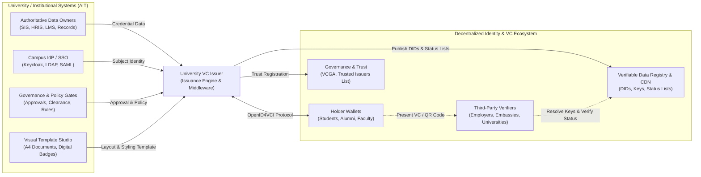
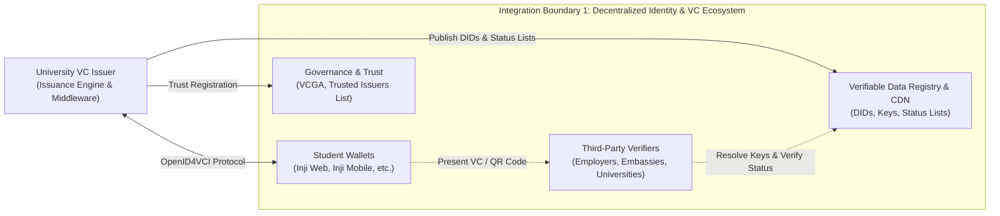
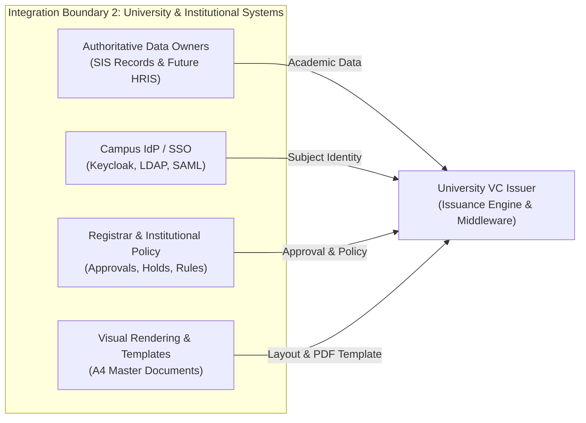
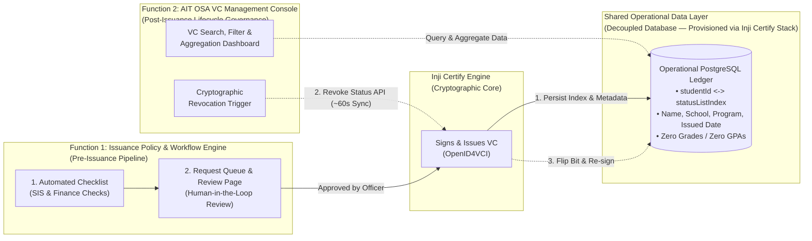
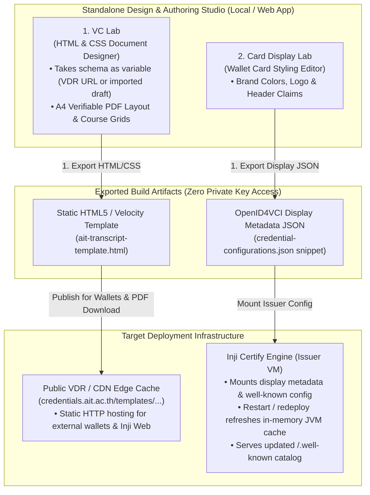
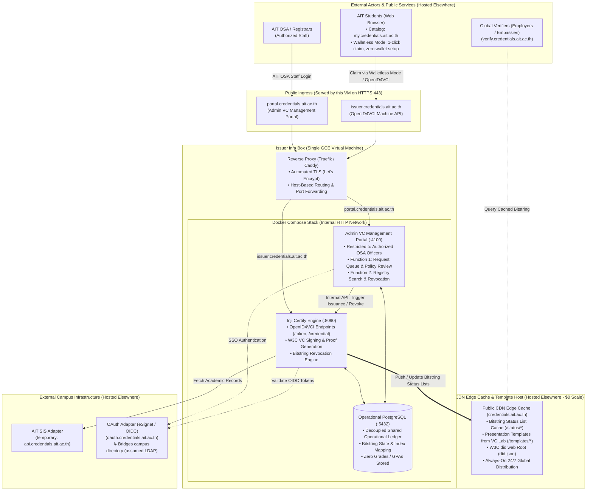
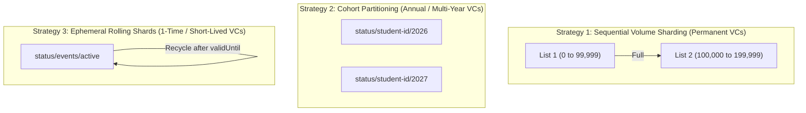
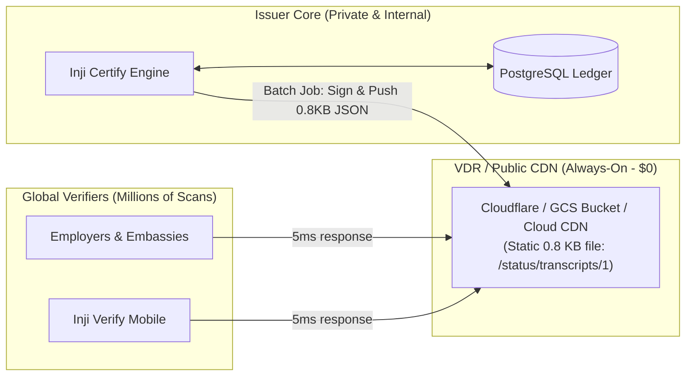

# Institutional VC Issuer Proposal: Architecture, Governance & Implementation

> [!IMPORTANT]
> **Foundational Starting Point**: This document is the conceptual foundation of the entire project. All developers, integrators, and stakeholders must understand the dual-boundary role of a complete university issuer before proceeding to specific institutional scopes or implementation milestones.

## 1. Overview: The Issuer as an Interoperability Bridge

Verifiable Credentials (VCs) are an open international standard (W3C) and an emerging global technology that modernizes how credentials of all kinds are originated, held, and verified. By combining digital signatures, tamper-evident cryptographic proofs, and decentralized identifiers, VCs eliminate reliance on easily forged physical paper documents, static PDFs, and slow, manual verification workflows.

Within the decentralized identity Trust Triangle (**Issuer**, **Holder**, and **Verifier**), the foundational entity responsible for asserting claims, originating data, and cryptographically signing credentials is the **Issuer**.

In this architecture, we propose the **Institutional VC Issuer as a plug-and-play middleware system** that integrates seamlessly with an organization's existing infrastructure. Rather than replacing, migrating, or disrupting core institutional systems, the Issuer acts as an interoperability bridge and serves as **another modern digital service touchpoint** for the organization. This allows the institution to issue any category of official digital credentials—such as academic degrees, diplomas, course completion certificates, student IDs, employment attestations, and academic transcripts—through a unified issuance architecture.

Because of this middleware design, the complete Institutional VC Issuer operates across two distinct integration boundaries:

1. **Integration Boundary 1: Decentralized Identity & VC Ecosystem**
   Connects the institution to the global decentralized identity landscape. Ensures strict compliance with open international and national standards (W3C Verifiable Credentials, OpenID4VCI, W3C Bitstring Status Lists) for seamless interoperability with any compliant digital wallet (e.g., Inji Web/Mobile, Apple Wallet, Google Wallet) and national Verifiable Data Registries (VDRs). Crucially, this establishes **credential co-ownership**—granting credential holders (students, alumni, faculty, staff) permanent, sovereign custody over their digital credentials in their personal wallets while ensuring the institution retains complete, authoritative revocation and lifecycle governance.

2. **Integration Boundary 2: Existing Institutional Systems**
   Connects the issuer engine to existing campus systems without requiring modifications to legacy infrastructure. Integrates with institutional **Identity Providers (IdP)** (e.g., LDAP, Active Directory, Keycloak, OAuth 2.0 / OIDC, SAML SSO) for subject authentication and with authoritative campus **Data Owners** (e.g., Student Information Systems for student records and degrees, HRIS/HRO for faculty and staff employment records, LMS for learning badges). This boundary also enforces institutional governance policies (departmental approvals, academic and financial clearance holds) and binds credentials to official institutional visual styling (such as verifiable A4 documents or digital credential cards).

### Architectural Blueprint: Starting from Official Academic Transcripts at AIT

While the architecture is designed generically to support any institutional credential type, this project establishes and validates the complete production-grade blueprint for the **Asian Institute of Technology (AIT)**, beginning with the most structurally complex and high-stakes document: **the official academic transcript**.



---

## 2. Integration Boundary 1: Decentralized Identity & VC Ecosystem

This boundary governs how the university interacts with standard digital identity components, international credential standards, and third-party systems:



### 2.1 Credential Issuance Modalities & OpenID4VCI

To eliminate phishing risks and avoid maintaining extraneous external SMS gateways or automated email dispatchers, the institution strictly avoids out-of-band delivery links. The project's active implementation focuses on **two primary digital claiming modalities**, while establishing an **architectural extension** for physical counter printing:

#### Active Implementation Scope (What We Will Deliver)

1. **Modality 1: Claiming with a Digital Wallet (Standard OpenID4VCI)**:
   - **Target Audience**: Students, alumni, or faculty who use a digital wallet (e.g., Inji Mobile, Inji Web in persistent mode, or any compliant OpenID4VCI wallet).
   - **Protocol Flow**: Standard **OpenID4VCI Authorization Code Flow**. The wallet initiates the connection to `issuer.credentials.ait.ac.th`, redirects the student to AIT Campus SSO via our OAuth Adapter (`oauth.credentials.ait.ac.th`, bridging campus directory / LDAP) for subject authentication, and receives the signed credential (JSON-LD / SD-JWT) cryptographically bound to the wallet’s private key.
   - **Metadata Discovery**: Exposes standard `.well-known/openid-credential-issuer` metadata detailing supported credential formats, cryptographic suites, and claim display properties.
   - **Presentation**: Presented dynamically to relying parties via OpenID4VP.

2. **Modality 2: Walletless Claiming (Self-Service Verifiable A4 PDF)**:
   - **Target Audience & Use Cases**:
     - *Frictionless Experience for Non-Wallet Users*: Built for students who are not currently digital wallet users and are unwilling to adopt or install any wallet app (whether an AIT institutional wallet or their home country's national digital wallet). They receive an immediate, frictionless web experience directly in their browser without creating accounts, remembering passphrases, or managing passkeys and PINs.
     - *Zero-Wallet & Temporary Distribution*: Specifically designed for short-term, point-in-time scenarios where relying parties lack digital wallet infrastructure—such as attaching a PDF to job applications, emailing transcripts to recruiters, or presenting a printout for temporary visa processing.
   - **Execution Flow**:
     - The student navigates directly to the **Student VC Catalog** (hosted at `my.credentials.ait.ac.th` in Walletless Mode).
     - The catalog operates in **Walletless Mode** (powered by Inji Web configured to bypass wallet account creation).
     - The student selects their credential (e.g., Official Academic Transcript), clicks **Claim**, and authenticates via familiar AIT Campus SSO through the OAuth Adapter (`oauth.credentials.ait.ac.th`).
     - Inji Certify signs the W3C Verifiable Credential, and the wallet presentation layer (Inji Web) compiles the signed claims, visual template, and verification QR code into an official, print-accurate **A4 Verifiable PDF**.
     - The student directly downloads the `.pdf` file to their local machine or smartphone.
   - **Lifespan Policy (Temporary / Time-Bound Expiration)**: Because digital PDF files and home-printed copies on plain paper are rarely carefully maintained—they are frequently left on public computers, forgotten in download folders, or forwarded insecurely—self-service downloads are configured with a **time-bound expiration window** (e.g., valid for 90 days via `validUntil`). If an employer or embassy scans a self-printed copy after 90 days, the verifier indicates that the temporary download has expired and instructs them to request a fresh copy (which active students and alumni can re-generate in 1 click via AIT SSO).
   - **Immediate Offline & Physical Verification**: The downloaded PDF is completely self-contained. Anyone inspecting the physical printout or the digital PDF can verify its authenticity and revocation status instantly using any standard smartphone camera or via `verify.credentials.ait.ac.th`.

#### Architectural Extension (What Can Be Done: Future Physical Integration)

- **Official Physical Paper Transcripts with Visible Digital Seals (VDS)**:
  - *Context & Capability*: While the immediate project focuses on delivering the digital modalities above, the Issuer architecture naturally supports upgrading traditional counter-issued physical documents whenever the university chooses to adopt it.
  - *Workflow & Divergent Pipeline*: Unlike student self-service downloads, this physical workflow is **triggered exclusively by Registrar staff** via the Admin Portal (`portal.credentials.ait.ac.th`) after formal graduation audits and printed onto official university security stationery (with embossed seals, crests, and watermarks).
  - *Perpetual Lifespan*: Because official physical documents are preserved as lifetime heirlooms by alumni, the credential **never expires** (omits `validUntil`), remaining subject only to real-time Bitstring revocation on the VDR.
  - *Zero Workflow Disruption*: This capability requires zero modifications to the underlying engine, demonstrating how the university can modernize physical counter printing in the future without deploying separate systems.

> [!NOTE]
> **No Out-of-Band Distribution Channels**: Delivery mechanisms such as unauthenticated email attachments, pre-authorized email claim links, or SMS OTP links are explicitly excluded from the architecture.

### 2.2 Verifiable Data Registry (VDR)
- **Decentralized Identifier (DID) Management**: Maintain an institutional signing identity via standard DID methods (e.g., `did:web` for domain-linked discovery or `did:key` for sandbox environments).
- **Key Rotation & Proofs**: Generate and manage cryptographic key pairs for signing credentials (e.g., Ed25519, ECDSA, RSA) conforming to W3C Linked Data Signatures or JOSE/COSE.
- **Revocation & Status Lists**: Host privacy-preserving status mechanisms (such as **W3C Bitstring Status List 2021/2026** or Token Status List) on the VDR, allowing verifiers to confirm revocation status without tracking individual students.

### 2.3 Verifiable Credential Governance Authority (VCGA) & Trust Frameworks
- **Accreditation & Registry**: Register the university as an authorized academic issuer within national, regional, or consortium Trust Registries / Trusted Issuers Lists (TIL).
- **Governance Compliance**: Comply with ecosystem trust policies (e.g., MOSIP Identity Trust Framework, EBSI, eIDAS 2.0, or national higher-education accreditation councils).
- **Schema Governance**: Publish and adhere to globally recognized schema definitions so verifiers can parse academic records deterministically.

### 2.4 Third-Party Verifiers
- **Standard Payload Formats**: Emit credentials conforming to **W3C Verifiable Credentials Data Model (VCDM 1.1 / 2.0)**, JSON-LD contexts, or SD-JWT VC (Selective Disclosure).
- **Public Schema Discovery**: Provide publicly resolvable credential schemas and contexts so verifying organizations (employers, foreign universities, embassies) can validate syntax and semantics.

---

## 3. Integration Boundary 2: University & Institutional Systems

This boundary connects the issuer engine to the university's internal records, administrative personnel, and institutional identity infrastructure:



### 3.1 Identity & Access Management (OAuth Adapter & Campus Directory)
- **Subject Authentication & OAuth Adapter Architecture (`oauth.credentials.ait.ac.th`)**:
  - *Decoupling from Legacy Protocols*: The exact URL and protocol of AIT's central Identity Provider are currently unconfirmed, but assumed to be institutional LDAP or Active Directory. Standard digital wallet issuance (OpenID4VCI) and modern web management consoles require standard OAuth 2.0 / OpenID Connect (OIDC).
  - *Dedicated OAuth Adapter Deployment*: To isolate the VC Issuer stack from legacy directory protocols and avoid altering AIT's campus IT infrastructure, the project introduces a dedicated **OAuth Adapter** (leveraging **eSignet** or an equivalent OIDC bridge) deployed at **`oauth.credentials.ait.ac.th`**.
  - *Protocol Translation & Downstream Bridging*:
    - **Downstream**: The adapter interfaces directly with AIT's campus directory (assumed LDAP) to verify student and staff login credentials.
    - **Upstream**: The adapter exposes standard OIDC endpoints (`/.well-known/openid-configuration`, `/authorize`, `/token`, `/userinfo`, `/jwks.json`) to Inji Certify, Inji Web (Student Catalog), and the AIT Admin Portal.
  - *Forward Compatibility (Campus-Wide Identity Cards)*: While Phase 1 targets student academic transcripts, this identity boundary is architected for institutional extensibility. Extending authentication to the entire AIT community (students, faculty, and administrative staff) directly enables issuing **Verifiable Credentials for Institutional Identity Cards** (e.g., digital Student ID cards, Faculty & Staff credentials, and campus access passes) using the same core Issuer infrastructure.
- **Authoritative Identity Binding**: Validates that the authenticated campus identity (`sub` claim in the OIDC ID token) matches the recipient's institutional identifier in the authoritative database (`studentId` in SIS or future `employeeId` in HRIS). Cryptographically binds the credential payload to the recipient (via wallet public key for in-wallet credentials, or directly in the signed verifiable document for PDF issuance).
- **Middleware-Enabled Advanced Verification via eSignet (Future Capability)**:
  - Higher-assurance verification mechanisms—such as photo liveness checks, facial biometric matching against institutional records, MOSIP identity bridging, or step-up MFA—are **not an operational responsibility of AIT IT**.
  - *Enabled by the OAuth Adapter Layer*: Because the integration team owns the OAuth Adapter at `oauth.credentials.ait.ac.th` (leveraging eSignet or modular OAuth plugins), these advanced verification capabilities can be activated natively at the identity boundary with zero development burden or configuration changes required on AIT's central directory or Inji Certify.

### 3.2 Student Information System (SIS) & Authoritative Data Ownership
- **AIT Office of Student Affairs (OSA) as Authoritative Data Owner**:
  - The **AIT Office of Student Affairs (OSA)** is the institutional Data Owner for all official student academic records, grades, course histories, and degree conferrals.
  - The VC Issuer does not replace, alter, or maintain a secondary authoritative system of record; it strictly interfaces with SIS on demand to extract validated records for cryptographic signing.
- **Co-Owned REST Adapter for Transparency & Auditability**:
  - To prevent tight coupling to legacy databases or custom vendor plugins, the integration plan establishes a **co-owned REST Adapter** (temporary hostname: `api.credentials.ait.ac.th`) functioning as an Anti-Corruption Layer between SIS and Inji Certify.
  - *Full Auditability for AIT OSA*: AIT OSA maintains complete transparency and governance over all data leaving the SIS boundary:
    - *Code & Query Inspection*: OSA can directly inspect the adapter's source code, including the exact SQL queries executed against the SIS database.
    - *Payload Verification*: OSA can audit and inspect the runtime query outputs and JSON payloads fetched during issuance events, guaranteeing that only explicitly authorized academic fields are exposed.
- **Strict Data Minimization & Privacy (Zero Redundant PII Storage)**:
  - In the current project scope, Inji Certify maintains **zero redundant student academic records** (no semester grades, course lists, or GPAs are persisted in the Issuer database).
  - The Issuer ledger strictly retains only the minimal operational attributes required to support essential **VC lifecycle governance** (such as search, filtering, and revocation management by authorized staff):
    - `Student ID`, `Student Name`, and high-level categorical fields (e.g., `School / Department`, `Degree Program`) as agreed upon with AIT OSA.
    - All detailed transcript records are fetched on-the-fly at the millisecond of issuance and immediately released from active memory once the credential is cryptographically signed.
- **Issuance Paradigms (Current Scope vs. Future Extensibility)**:
  - *Current Scope (Real-Time Synchronous Issuance)*: Operates exclusively on an **on-demand, real-time synchronous model** triggered directly by the holder (the student claiming in their digital wallet or downloading the verifiable PDF in the catalog).
  - *Future Extensibility (Batch & Pre-Fetch)*: The adapter architecture is designed to support alternative issuance paradigms in subsequent phases without refactoring:
    - **Batch Issuance**: Enabling AIT OSA to trigger bulk issuance for an entire graduating class following academic senate degree approvals.
    - **Pre-Fetch / Scheduled Staging**: Pre-generating signed credentials ahead of peak graduation ceremonies for instant student retrieval.

### 3.3 Institutional Governance: Issuance Policy Engine & VC Management

To ensure institutional sovereignty and facilitate a smooth long-term handover to AIT, institutional governance is decoupled into **two distinct functional pillars**: an adaptable **Issuance Policy Engine** (managing business rules, checklist execution, and human approval gates) and a purpose-built **VC Management Console** (serving as AIT OSA's operational dashboard).



#### Function 1: The Issuance Policy & Workflow Engine (Pre-Issuance Pipeline)
- **Mission & Core Responsibilities**:
  - Governs the end-to-end journey from **student request submission to cryptographic issuance** for both **Modality 1 (Digital Wallet Claiming via OpenID4VCI)** and **Modality 2 (Walletless Verifiable PDF)**.
  - **Automated Prerequisite Checklist**:
    - *Academic Eligibility*: Queries the SIS Adapter to confirm degree conferral, curriculum completion, and formal Senate graduation approval.
    - *Financial Clearance*: Verifies zero outstanding tuition, library fines, or housing holds.
  - **Dedicated Request Queue & Review Page (Human-in-the-Loop)**:
    - Hosts the operational inbox where authorized AIT OSA officers review pending student claims and inspect checklist evaluation results.
    - Officers click **Approve** (releasing the credential to Inji Certify for signing) or **Reject** (with audit reasons returned to the student).
    - AIT retains full institutional autonomy to toggle this queue between manual review and automated straight-through issuance.
- **Architectural Flexibility & Implementation Paths**:
  - **Option A (On-Prem Low-Code Orchestrator, e.g., On-Prem Windmill)**: A self-hosted visual workflow engine that provides the **approval inbox and review page natively out-of-the-box**. Campus staff can drag-and-drop checklist steps and modify approval routing without frontend or backend coding.
  - **Option B (Custom Declarative Python Engine Developed In-House)**: A lightweight policy runner embedded into the gateway that evaluates declarative YAML/JSON checklists and serves a streamlined review queue page.
  - **Zero Licensing Burden & Full Control**: Both options are 100% free, open-source, and self-hosted on AIT infrastructure.

#### The Shared Operational Data Layer (Decoupled PostgreSQL)
- **Neutral, Decoupled Persistence**:
  - The operational PostgreSQL database **belongs neither privately to Inji Certify nor to Function 2 (AIT OSA Console)**.
  - While it is initialized and provisioned as part of the Inji Certify Docker Compose stack, it serves as the **neutral, shared persistence backbone** for the campus credential infrastructure:
    - **Inji Certify** writes the cryptographic index mapping (`studentId` $\leftrightarrow$ `statusListIndex`), lifecycle state (`ACTIVE` / `REVOKED`), and key metadata upon issuance.
    - **AIT OSA Console (Function 2)** directly queries this database to execute real-time search, multi-attribute filtering, and dashboard aggregations.
  - **Strict Data Minimization Guarantee**: The database persists only minimal administrative attributes (`studentId`, `studentName`, `school`, `degreeProgram`, `issuanceDate`, `statusListIndex`, `lifecycleStatus`)—never course grades, credit histories, or GPAs.

#### Function 2: AIT OSA VC Management Console (Post-Issuance Lifecycle Governance)
- **Mission & Core Responsibilities**:
  - Focuses strictly on **post-issuance lifecycle operations** for credentials that have already been minted and stored in the operational ledger.
  - **PostgreSQL Operational Querying & Attribute-Based Search**: Connects directly to the operational PostgreSQL database to query, list, search, and filter issued credentials using minimal metadata (`studentId`, `studentName`, `school / faculty`, `degreeProgram`, `issuanceDate`, `statusListIndex`, `lifecycleStatus`) without querying or storing full academic transcripts.
  - **Revocation Workflow (~60-Second Cron-Like Sync with Inji Certify)**: An authorized officer locates an issued credential and triggers revocation. The console calls Inji Certify's status API to flip the bit at the student's `statusListIndex`. Operating on a ~60-second cron-like sync cycle, Certify re-signs the Bitstring array and pushes the updated status file to the public CDN edge cache (`credentials.ait.ac.th/status/*`).
  - **Executive Dashboard Built on Database Aggregations**: Surfaces real-time KPI metrics, school/faculty breakdowns (SET, SERD, SOM), and immutable chronological audit trails directly from database aggregation queries over the operational ledger.
- **Architectural Flexibility & Implementation Paths**:
  - **Option A (Off-the-Shelf Open-Source Admin Platform, e.g., On-Prem Directus)**: An instant, zero-code administrative platform connected directly to PostgreSQL. Dedicated to historical search, filtering, aggregation dashboards, and triggering revocation webhooks.
  - **Option B (Custom Tailored Web Application Developed In-House, e.g., Python FastAPI / SQLAdmin)**: A purpose-built administrative web app embedded directly into the Python gateway service, offering a custom search, metrics, and revocation interface.
  - **Zero Licensing Burden & Full Control**: Both options are 100% free, open-source, and self-hosted on AIT infrastructure, ensuring long-term institutional maintainability by campus staff.

### 3.4 Standalone Presentation Design & Authoring: VC Lab & Card Display Lab

Visual rendering bridges cryptographic claims into human-readable institutional documents. The presentation authoring studio—comprising **VC Lab** and **Card Display Lab**—is architected as **completely standalone design tools** with zero runtime coupling to live campus databases or the core cryptographic signing engine. Both tools operate schema-first (fetching published schemas or importing local drafts) and export static, auditable artifacts.



#### 1. VC Lab: Presentation Template Designer
- **Role & Capabilities**:
  - A low-code visual editor allowing university designers to build, preview, and refine official credential presentation layouts using standard HTML5, CSS3, and Velocity placeholders (`#claimValue(...)`).
  - Styles the official university transcript layout: AIT crest positioning, header typography, two-column semester course tables, cumulative GPA badges, watermark background, and registrar signature blocks.
  - Serves both **Modality 1 (Detailed In-Wallet Document View)** and **Modality 2 (Print-Ready Verifiable A4 PDF)**.
- **Schema Input & VDR Publishing**:
  - **Schema as Input Variable**: VC Lab takes the schema dynamically as a parameter—either fetching a published schema by URL from the VDR (`trust.credentials.ait.ac.th`) or allowing the designer to upload an unpublished draft JSON Schema. This ensures claim placeholders match cryptographic data keys without hardcoding schema dependencies.
  - Exports the static HTML5/Velocity template bundle, which is published to the **public VDR / CDN edge** (`https://credentials.ait.ac.th/templates/ait-transcript-v1.html`) so third-party digital wallets and PDF download renderers can load the official university layout.
- **Strict Cryptographic Boundary (Zero Private Key Access)**:
  - **VC Lab never accesses or requires the Issuer's private signing key.**
  - The presentation template is a static visual asset (HTML/CSS), requiring only standard web hosting permissions (CDN upload / GitOps commit), not cryptographic signing.
  - The private key remains strictly locked inside Inji Certify / HSM / Cloud KMS, used solely at runtime when Certify cryptographically signs student credentials.

#### 2. Card Display Lab: Wallet Card & Catalog Styling
- **Role & Capabilities**:
  - Companion design tool to style the compact "credit-card" representation shown on digital wallet home screens (Apple Wallet, Google Wallet, Inji Mobile) and the student self-service catalog.
  - Configures institutional brand colors (`background_color: "#004721"`), typography (`text_color: "#FFFFFF"`), crest logo positioning, and headline summary claims (*"Degree Awarded"*, *"Student Name"*, *"Graduation Year"*).
- **Output Artifact (OpenID4VCI Display Metadata JSON)**:
  - Exports an authoritative **OpenID4VCI Display Metadata JSON** configuration snippet.
  - Injected into **Inji Certify’s** credential configuration (`credential-configurations.json`), which Certify serves on the public discovery endpoint:
    ```http
    GET /.well-known/openid-credential-issuer
    ```
- **How Wallets Consume Display Metadata**:
  - Wallets fetch this metadata during the initial OpenID4VCI discovery phase (before student login) to render a branded consent dialog.
  - Upon credential issuance, the wallet saves this metadata locally alongside the VC, allowing the native card face to render instantly and offline in the wallet app.

#### 3. Deployment Mechanism: GitOps & Server Restart (No In-Place Live Updates)
- **Zero Dynamic / In-Place Update APIs**:
  - To maintain production stability, cryptographic immutability, and security compliance, there is **no dynamic, in-place update API** between the design labs and the live Issuer.
  - A design tool running on a web browser or designer laptop cannot make live HTTP `PUT` requests to mutate production templates in memory.
- **GitOps-Driven Promotion**:
  - Operational staff commit exported HTML templates and Display Metadata JSON into the university's configuration repository.
  - Automated CI/CD pipelines push public template assets to the VDR/CDN edge.
- **Inji Certify Restart Requirement (Decoupled from Wallets)**:
  - Mounting updated display configurations into Inji Certify requires **restarting or redeploying Inji Certify**.
  - This server restart reloads configuration files from the VM disk into JVM memory and refreshes the `/.well-known/openid-credential-issuer` catalog endpoint with zero runtime attack surface.
  - **Decoupled Client Responsibility**: The Issuer is responsible strictly for Inji Certify. Third-party client wallets and web wallets consume public metadata and templates over standard HTTP; restarting client wallets is never the Issuer's operational responsibility.

---

## 4. Summary: The Complete Issuer Capability Matrix

| Capability Area | VC Ecosystem Facing (Boundary 1) | University Campus Facing (Boundary 2) |
|---|---|---|
| **Identity & Authentication** | Holder key binding, wallet DID negotiation | Campus SSO / Keycloak / LDAP student login |
| **Protocol & Transport** | OpenID4VCI endpoints (`/credential`, `/token`) | Internal REST APIs, event queues, CSV ingestion |
| **Data & Claims** | W3C VCDM 2.0 / JSON-LD / SD-JWT schemas | SIS database queries, course catalog models |
| **Pre-Issuance Policy & Pipeline (Function 1)** | OpenID4VCI credential offer & format validation | Pluggable policy engine (On-prem Windmill / declarative Python) with human-in-the-loop review queue |
| **Operational Data Layer (Decoupled)** | Status list bit mapping (`studentId` $\leftrightarrow$ `statusListIndex`) | PostgreSQL operational persistence (zero grades/GPAs, administrative metadata only) |
| **Post-Issuance VC Governance (Function 2)** | Bitstring Status List re-signing & CDN sync (~60s) | AIT OSA Console (attribute search, KPI dashboard, revocation API) |
| **Visual Presentation Design Studio** | OpenID4VCI Display Metadata JSON (Card Display Lab) | Master Transcript A4 PDF & in-wallet detail template (VC Lab) |

---

## 5. Architectural Design Principles: The "Issuer in a Box"

To satisfy both the enterprise cryptographic requirements of Inji Certify and modern cloud-native operational standards, the project implements the **"Issuer in a Box"** architectural pattern. 

This single virtual machine serves strictly two public ingress domains:
1. **`portal.credentials.ait.ac.th`**: The **Admin VC Management Portal** (specifically restricted to authorized AIT OSA officers and administrators to manage, review, issue, and revoke academic credentials).
2. **`issuer.credentials.ait.ac.th`**: The dedicated **Machine-to-Machine API Entrance** (serving standard OpenID4VCI protocol endpoints directly to digital wallets).

Public Student Catalog, Identity Anchors, and the Verifiable Data Registry (VDR) are decoupled and hosted externally:
- **`credentials.ait.ac.th`**: The canonical **Verifiable Data Registry (VDR)** (`did:web:credentials.ait.ac.th`), hosting static `did.json`, Bitstring Status Lists, and presentation templates on a public CDN edge ($0 scale).
- **`my.credentials.ait.ac.th`**: The dedicated **Student VC Catalog (Walletless Mode)**—powered by Inji Web—allowing students to discover and claim transcripts via AIT Campus SSO in 1 click without creating a wallet account, remembering a passcode, or downloading an app.




### 5.1 Core Architectural Principles & Component Boundaries

1. **Edge Ingress & Automated SSL (Traefik / Caddy)**:
   - Binds to host ports `80` and `443` on the VM.
   - Terminates public HTTPS and automatically issues/renews **Let's Encrypt TLS certificates** strictly for the two subdomains served by this VM: `portal.credentials.ait.ac.th` and `issuer.credentials.ait.ac.th`.
   - Forwards traffic to internal Docker services over plain HTTP, eliminating the need to manage complex Java keystores (`.jks`) inside containers.
   - Protects internal endpoints by blocking `/admin` and `/actuator` paths from unauthorized public networks.

2. **Inji Certify as the Pure Cryptographic & Signing Engine**:
   - Runs Spring Boot with an embedded Apache Tomcat web server (listening on internal HTTP `:8090`).
   - **Owns 100% of OpenID4VCI**: Student wallets communicate directly with Certify through the edge proxy (`issuer.credentials.ait.ac.th`) for all protocol endpoints (`/.well-known/...`, `/token`, `/credential`).
   - **Pure Cryptographic Output**: Certify accepts holder keys and academic claims, verifies OIDC tokens against the OAuth Adapter's JWKS (`oauth.credentials.ait.ac.th`), and signs W3C Verifiable Credentials (JSON-LD / SD-JWT). It has zero knowledge of visual styling or PDF compilation.
   - **Relieved of User Authentication**: Certify strictly verifies signed OIDC tokens against `oauth.credentials.ait.ac.th`'s JWKS and signs W3C Verifiable Credentials.
   - **Zero Recompilation for Authentication Upgrades**: When layering advanced verification (such as biometric face matching, MOSIP identity bridging, or step-up MFA via eSignet / our OAuth adapter), **zero code changes or redeployments** are required in Inji Certify or AIT's central directory.
   - **Stateless Operation**: Holds zero user sessions and sets zero cookies.

3. **Stateless University Integration via Co-Owned REST Adapter (Temporary Hostname: `api.credentials.ait.ac.th`)**:
   - Instead of coupling Inji Certify directly to legacy campus databases or custom Java plugins, Certify invokes an external, standard **REST Data Provider** (`GET /students/:id/transcript`).
   - **Co-Owned by AIT OSA & Integration Team**: The **AIT SIS Adapter Middleware** acts as a transparent Anti-Corruption Layer. AIT OSA (authoritative Data Owner) retains full audit rights over the adapter's source code, SQL queries, and fetched JSON payloads to verify exactly what data leaves the SIS boundary.
   - **Strict Data Minimization & Privacy (Zero Redundant PII Storage)**: Inji Certify persists zero student grades, course lists, or GPAs—only retaining minimal identifiers (`studentId`, `name`, `school`) necessary for registrar search, filtering, and revocation lifecycle operations. Academic records are fetched on-the-fly at the millisecond of issuance.
   - **Multi-Credential & Multi-Device Governance**:
     - *Multiple Qualifications (Master's + Ph.D.)*: Treated as distinct credentials (`degreeId`), each with its own independent status list bit and lifecycle.
     - *Multi-Device Wallets (Phone + Laptop)*: Supported concurrently via distinct holder DIDs (`_holderId = did:key:...`).
     - *Duplicate Prevention*: Idempotency checks and pre-issuance gating prevent duplicate active credentials within the same wallet.

4. **The AIT Admin VC Management Portal (AIT OSA Governance & Control Center — `:4100`)**:
   - A dedicated web application serving strictly as the **administrative and governance control center for AIT OSA** at `portal.credentials.ait.ac.th`.
   - **Restricted Staff Access**: Only authorized AIT OSA officers and administrators log in via Campus SSO through the OAuth Adapter (`oauth.credentials.ait.ac.th`).
   - **Governance & Policy Scope (Unifying Functions 1 & 2)**:
     - *Function 1 (Pre-Issuance)*: Evaluates automated prerequisite checklists (academic Senate eligibility, financial clearance) and hosts the human-in-the-loop request review inbox where registrars approve or reject student claims.
     - *Function 2 (Post-Issuance)*: Directly queries the shared operational PostgreSQL database to search and filter issued credentials, displays aggregation KPI dashboards, and executes real-time Bitstring credential revocations (~60s sync with Certify).

5. **The Student VC Catalog in Walletless Mode (`my.credentials.ait.ac.th`)**:
   - Powered by Inji Web configured in **Walletless Mode** (bypassing persistent wallet storage and PIN setup) at `my.credentials.ait.ac.th`.
   - Students select the AIT Official Transcript, click Claim, authenticate with their familiar AIT Campus credentials via the OAuth Adapter (`oauth.credentials.ait.ac.th`), and claim their credential.
   - **Client-Side / Wallet PDF Compilation**: When the student downloads their transcript, the wallet layer (Inji Web) compiles the signed VC claims and offline verification QR code into the VC Lab HTML template, generating the official A4 PDF directly for the student.

6. **The Public CDN as VDR, Bitstring Status Cache & Presentation Template Host (Edge Offloading)**:
   - **Bitstring Status List Offloading**: When a transcript is issued, suspended, or revoked by AIT OSA, Inji Certify updates the status bit at the student's index in the operational PostgreSQL ledger. Operating on an automated cron-like cycle (e.g. every 60 seconds), Certify cryptographically signs the updated bitstring array and **pushes / updates the static cache file on the Public CDN** (`credentials.ait.ac.th/status/*`).
   - **Presentation Templates (Created from VC Lab)**: The official HTML/CSS transcript presentation templates created and authored in **VC Lab** are published directly to the public CDN (`credentials.ait.ac.th/templates/*`). External digital wallets, Inji Web (Walletless Mode), and verifier renderers fetch these static templates directly from the edge cache to display the credential and compile download PDFs without contacting or placing compute load on the Issuer VM.
   - **Zero-Cost High Availability ($0 Scale)**: The CDN acts as an always-on, high-speed, zero-cost edge layer ($0 scale) that absorbs 100% of global verification queries and static template fetches (employers, embassies, verifier apps) without letting third-party traffic ever hit or overload the Issuer VM.

### 5.2 Canonical Institutional Domain & Routing Table

| Subdomain / URL | Target Component | Protocol & Ports | Hosting Location | Purpose |
|---|---|---|---|---|
| **`portal.credentials.ait.ac.th`** | Admin VC Management Portal | HTTPS (443) $\rightarrow$ `:4100` | 🖥️ **Issuer VM** | Administrative control center for AIT OSA to govern policies, review clearances, audit, and revoke credentials |
| **`issuer.credentials.ait.ac.th`** | Inji Certify Engine | HTTPS (443) $\rightarrow$ `:8090` | 🖥️ **Issuer VM** | **Machine API Entrance**: OpenID4VCI machine-to-machine wallet endpoints (`/.well-known/openid-credential-issuer`, `/token`, `/credential`) |
| **`credentials.ait.ac.th`** | VDR Root & Public Edge CDN | HTTPS (443) | ☁️ **External CDN / GCS** | **Canonical VDR, Bitstring Cache & Template Host**: Updated by the Issuer; serves `did.json`, cached Status Lists, and VC Lab presentation templates (`/templates/*`) to wallets and verifiers |
| **`my.credentials.ait.ac.th`** | Student VC Catalog (Inji Web) | HTTPS (443) | 🌐 **Web Hosting / Cloud** | **Student Credential Portal**: Self-service student catalog running Inji Web in Walletless Mode (1-click transcript claim via SSO, instant PDF download) |
| **`verify.credentials.ait.ac.th`** | AIT Web Verifier | HTTPS (443) | ⚡ **Google Cloud Run** | Stateless public verifier for printed PDF QR codes and uploaded documents ($0 scale-to-zero) |
| **`oauth.credentials.ait.ac.th`** | OAuth / OIDC Adapter (eSignet) | HTTPS (443) | 🏫 **Campus IT / DMZ** | **Identity Adapter**: Bridges unconfirmed campus directory (assumed AIT LDAP) to standard OIDC authorization code flow & JWKS for Inji Certify, Inji Web, and Admin Portal |
| **`api.credentials.ait.ac.th`** *(temporary)* | SIS Adapter Middleware | HTTP (Private VPC / `:8082`) | 🏫 **Campus IT (Ext.)** | Anti-Corruption Layer co-owned with AIT OSA for auditable database queries and clean JSON payload translation |
| **`trust.credentials.ait.ac.th`** | AIT Institutional VCGA | HTTPS (443) | 🌐 **Consortium / Web** | **AIT-Owned Governance Registry**: Canonical schema registry, accreditation declarations, and credential governance policies owned and operated by AIT |

### 5.3 Continuous 24/7 Operations: Dedicated Compute & Instant Responsiveness

- **24/7 Continuous Operation**: The Issuer VM runs 24/7 as an always-on institutional service to guarantee instantaneous availability for student transcript claims (OpenID4VCI), administrative review and clearance by AIT OSA officers, and continuous Bitstring status synchronization.
- **Always-Hot Services & Zero Latency**: Running continuously keeps Inji Certify's Java Spring Boot runtime, connection pools, and internal cryptographic caches hot around the clock, completely eliminating cold-start delays.
- **Predictable, Low Cost Profile**: A single dedicated virtual machine (`e2-standard-2`, ~$25–$30/month) co-locates Inji Certify, the Admin Portal, and PostgreSQL, delivering high reliability and operational simplicity without the complexity of sleep/wake state machines.
- **Edge Offloading for Global Scale**: While the Issuer VM runs 24/7, high-volume verification traffic from employers, embassies, and verifier apps is absorbed 100% by the public CDN edge cache (`credentials.ait.ac.th`), shielding the VM from external traffic spikes.

### 5.4 PostgreSQL as an Operational Revocation & Lifecycle Ledger
- **Mental Model Shift**: PostgreSQL is **not** the enterprise system of record for student grades; it functions as the **shared, neutral operational data layer** belonging neither to Inji Certify nor to Function 2 (AIT OSA Console). It stores only minimal operational metadata (bitstrings, index allocations, and credential status) while persisting **zero course grades, credit histories, or GPAs**.
- **Co-Located Operational Footprint**:
  PostgreSQL is co-located as a Docker container on the VM's persistent disk. This eliminates the ~$55/month cost of an external Google Cloud SQL instance while operating seamlessly alongside Certify 24/7 at low, predictable cost. The permanent lifecycle state and status mappings are safeguarded through the multi-tier disaster recovery strategy below.

---

## 6. Data Resilience & Disaster Recovery Strategy

In decentralized identity, if an Issuer loses its database of which student was assigned which status list index (`student_id <-> statusListIndex`), it suffers from **"Lost Control" (Orphaned VCs)**—credentials remain valid in the wild on public VDRs, but the university can never revoke them.

To guarantee that the university never loses control of issued credentials, the architecture enforces a **4-Tier Resilience & Backup Strategy**:

| Tier | Backup Layer | Mechanism | Purpose | Environments | Cost Profile |
|---|---|---|---|---|---|
| **Tier 1** | **Hot Local Persistence** | GCP Persistent Disk volume (`pd-balanced`) | Operational continuity across container restarts and VM reboots | **Dev, Staging, Production** | Included in base VM disk ($0 extra) |
| **Tier 1.5** | **Fast-Rollback VM Snapshots** | Automated GCP Disk Snapshot (7-day rolling window) | Ultra-fast recovery (RTO < 5 min) from bad deployments or OS update failures | **Production Only** | Pennies (7-day differential disk) |
| **Tier 2** | **Warm Logical Cloud Backup** | Clean, portable `pg_dump` $\rightarrow$ **GCS Bucket** (30-day retention + versioning) | True disaster recovery: restores clean database if VM or disk is destroyed | **Staging, Production** | Low (< $1/month) |
| **Tier 3** | **Cold Annual Archive** | Annual academic-year freeze $\rightarrow$ **Separate Multi-Region GCS / On-prem** (WORM locked) | Permanent (50+ year) regulatory retention for academic degrees | **Production Only** | Negligible (Cold Archive tier) |

---

## 7. Project Milestones & Phased Roadmap

To manage technical risk, isolate dependencies, and deliver immediate institutional value to the university, the implementation is structured across two sequential milestones:

```mermaid
flowchart LR
  subgraph M1["Milestone 1: Integrate Boundary AIT"]
    direction TB
    M1_Data["AIT SIS Adapter Middleware<br/>(api.credentials.ait.ac.th)"]
    M1_Id["OAuth Adapter / eSignet<br/>(oauth.credentials.ait.ac.th)"]
    M1_Gov["AIT OSA Admin Portal<br/>(Pre-Issuance & Revocation)"]
    M1_Trust["AIT Institutional VCGA<br/>(trust.credentials.ait.ac.th)<br/>• AIT-Owned Schema & Policies"]
    M1_Lab["VC Lab & Card Display Lab<br/>(A4 Template & Wallet Styling)"]
    M1_Cat["Walletless Student Catalog<br/>(my.credentials.ait.ac.th)"]
    M1_Verify["AIT Web Verifier (Cloud Run)<br/>(verify.credentials.ait.ac.th)<br/>• Smartphone QR & PDF Upload"]
    M1_VM["24/7 GCE VM 'Issuer in a Box'<br/>(Co-located Postgres Cache)"]
  end

  subgraph M2["Milestone 2: Integrate Boundary VC Ecosystem Thailand"]
    direction TB
    M2_Trust["Emerging Thailand VCGA<br/>(National Trust Framework / TBD)<br/>• National Anchor Integration"]
    M2_DID["Production did:web PKI<br/>(Institutional / National Anchor)"]
    M2_Wallets["National & Cross-Wallet Interoperability<br/>(ThaID, Inji Mobile, mDoc/SD-JWT)"]
    M2_Verifiers["Federated Relying Party Ecosystem<br/>(OpenID4VP Presentation & Consortia)"]
  end

  M1 ==> M2
```



### Milestone 1: Integrate Boundary AIT (Campus Systems & Governance)
The foundational milestone focuses on **Integration Boundary 2 with AIT**, establishing the internal data pipelines, campus authentication, registrar governance, and presentation fidelity:
1. **Academic Data Authority Integration**: Deploy the co-owned REST Adapter (`api.credentials.ait.ac.th`) to query the AIT Student Information System (SIS), guaranteeing full data auditability for the Office of Student Affairs (OSA) with zero persistent student PII in the issuer database.
2. **Campus Identity Bridging**: Implement and deploy the dedicated OAuth Adapter (`oauth.credentials.ait.ac.th`, leveraging eSignet or modular OIDC) bridging AIT's campus directory (assumed LDAP) to standard OpenID Connect authorization code flow and JWKS.
3. **Institutional Governance & Console**: Deliver the unified AIT Admin Portal (`portal.credentials.ait.ac.th`):
   - *Function 1 (Pre-Issuance)*: Prerequisite checklist and human-in-the-loop registrar review queue.
   - *Function 2 (Post-Issuance)*: Historical student record search, aggregated analytics, and real-time cryptographic Bitstring revocation.
4. **AIT Institutional VCGA (`trust.credentials.ait.ac.th`)**: Establish AIT's own institutional Verifiable Credential Governance Authority (VCGA) and registry, publishing canonical transcript schemas, accreditation assertions, and institutional issuance policies under AIT's authoritative ownership.
5. **Presentation Authoring & Edge Publishing**:
   - Design the official print-accurate A4 Master Transcript template in **VC Lab** and publish static bundles to the public CDN (`credentials.ait.ac.th/templates/*`).
   - Style the wallet card and claim metadata in **Card Display Lab** and inject into Inji Certify's OpenID4VCI metadata.
6. **Self-Service Student Catalog**: Deploy the student catalog at `my.credentials.ait.ac.th` running Inji Web in **Walletless Mode** (1-click campus SSO claim, instant A4 PDF download with embedded verification QR).
7. **AIT Web Verifier (`verify.credentials.ait.ac.th`)**: Deploy the stateless public verifier microservice on Google Cloud Run ($0 scale-to-zero) for instant offline-to-online verification of printed PDF QR codes and uploaded transcript documents against AIT's DID and Bitstring status list.
8. **24/7 Dedicated Compute**: Deploy the "Issuer in a Box" stack on a single GCE virtual machine (`e2-standard-2`, ~$25–$30/month) running continuously 24/7 with co-located PostgreSQL persistence.

### Milestone 2: Integrate Boundary VC Ecosystem Thailand (National Trust & Interoperability)
The second milestone connects AIT's operational issuer to **Integration Boundary 1 (Thailand's National & Regional Decentralized Identity Ecosystem)**:
1. **Emerging Thailand National VCGA Alignment**: While Thailand's national Verifiable Credential Governance Architecture (VCGA) is currently undefined and emerging, Milestone 2 will monitor national trust initiatives (such as ETDA or national digital identity frameworks) and bridge AIT's institutional VCGA (`trust.credentials.ait.ac.th`) into the national trust registry once established.
2. **Production DID & PKI Migration**: Upgrade institutional signing keys from development sandboxes to production `did:web:credentials.ait.ac.th`, certified by authorized institutional certificate authorities.
3. **Cross-Wallet Interoperability**: Validate and certify transcript issuance across Thailand's digital wallet ecosystem—including national wallets (ThaID), community wallets (Inji Mobile), and platform wallets (Apple/Google Wallet via mDoc and SD-JWT formats).
4. **Federated Relying Party Ecosystem**: Enable seamless credential verification across domestic and international relying parties (Thai government agencies, multinational employers, foreign embassies, and global university admissions) via standard OpenID4VP wallet presentations and cross-ecosystem verifier federation.

---

## 8. Companion Specifications

- **[Verifier Scope & Architecture](./verifier-scope.md)**: Companion document detailing third-party verification architectures, everyday smartphone PDF QR scanning, OpenID4VP wallet presentations, and lightweight Cloud Run hosting.

---

## Appendix: Bitstring Capacity Planning, Partitioning & Lifecycle Strategies for Future VCs

When expanding the university issuer to new credential types (such as Student ID Cards, Alumni Badges, Library Passes, or Single-Use Event Tokens), architects must make intentional design choices regarding **capacity sizing, dataset separation, and bit recycling**.

### A.1 The Capacity Decision Framework: How Many VCs Will the System Hold?

Before minting any new credential type, answer two questions:
1. **Concurrency & Velocity**: How many active credentials will exist simultaneously, and how frequently are they issued/revoked?
2. **Lifespan**: Is the credential **Permanent** (Transcripts, Diplomas) or **Ephemeral / 1-Time** (Student IDs, Event Badges, Temporary Visitor Passes)?

#### Bitstring Size vs. Network Payload (Gzip Compression)
Because unrevoked bitstrings consist almost entirely of binary `0`s, modern HTTP compression (Gzip/Brotli) achieves ~99% compression ratios over the wire:

| Bitstring Allocation | Raw Uncompressed | Compressed Wire Size (Gzip) | Ideal Use Case |
|---|---|---|---|
| **100,000 bits** | 12.5 KB | **~0.8 KB** | High-Education Diplomas / Transcripts (50–100 years of cohorts) |
| **1,000,000 bits** | 125 KB | **~2.5 KB** | Multi-campus Student IDs / Active Staff Cards / Regional Consortia |
| **10,000,000 bits** | 1.25 MB | **~25 KB** | National Identity / Nationwide High-Volume Single-Use Badges |

Even a 1-million-bit status list downloads across 4G/5G mobile networks in **under 20 milliseconds**, making size concerns negligible for verifiers.

---

### A.2 The 3 Partitioning & Sharding Strategies

Depending on credential volatility, use one of three partitioning models:



#### Strategy 1: Sequential Volume Sharding (Transcripts & Diplomas)
- **Model**: `status/transcripts/1` $\rightarrow$ `status/transcripts/2` $\rightarrow$ `status/transcripts/N`.
- **Behavior**: Cumulative and immutable. When List 1 reaches ~95% capacity, Inji Certify begins issuing new credentials into List 2.
- **Recycling**: **Zero bit recycling**. Past indices remain permanently associated with their original graduates.

#### Strategy 2: Cohort Partitioning (Student IDs & Campus Access)
- **Model**: `status/student-id/2026`, `status/student-id/2027`.
- **Behavior**: Scoped to an academic intake or validity year.
- **Retirement**: When the Class of 2026 reaches its graduation expiration date, the entire 2026 list is retired. Verifiers reject expired credentials on date checks alone without querying the bitstring.

#### Strategy 3: Ephemeral Rolling Shards (1-Time Passes & Event Badges)
- **Model**: Fixed-size rolling list (e.g. 50,000 bits) for temporary single-use or daily credentials.
- **Behavior**: Used for campus visitor passes, exam admissions, or library day-access.

---

### A.3 Bitstring Index Recycling: The Golden Rules

Can a revoked or expired bit index be recycled and reassigned to a new student?

> [!CAUTION]
> **The Golden Rule of Bit Recycling**:  
> A bit index must **NEVER** be recycled while the previous credential can still be presented in the wild.
> 
> *Why?* If Student A's bit #42 was revoked (`bit 42 = 1`), and you reset bit #42 back to `0` to assign it to Student B:
> 1. If Student A attempts to present their old card, it will falsely appear **VALID**!
> 2. Conversely, if Student A is revoked later, Student B's valid card will be accidentally revoked!

#### When Recycling IS Permitted:
Bit recycling is **safe only after the credential's `validUntil` expiration date has elapsed**:
1. Every ephemeral or 1-time VC must include a strict `validUntil` timestamp (e.g., `validUntil: "2026-10-04T00:00:00Z"`).
2. Once that timestamp passes, compliant verifiers immediately reject the credential based on timestamp math, without ever consulting the bitstring.
3. Only after the `validUntil` buffer has cleared may Inji Certify safely return that bit index to the `status_list_available_indices` pool for reuse.

---

### A.4 Architectural Decision Matrix for Future Institutional VCs

| Credential Type | Intended Lifespan | Recommended Sizing | Partitioning Strategy | Recycling Policy |
|---|---|---|---|---|
| **Official Degree Transcripts** | Permanent (50+ years) | 100,000 bits | Sequential Volume Sharding (`/transcripts/N`) | ❌ **No Recycling** (Permanent audit ledger) |
| **Graduation Diplomas** | Permanent (50+ years) | 100,000 bits | Sequential Volume Sharding (`/diplomas/N`) | ❌ **No Recycling** (Permanent audit ledger) |
| **Student ID Cards** | 1 to 4 Years | 100,000 bits | Cohort Partitioning (`/student-id/YYYY`) |  **Cohort Retirement** upon class graduation |
| **Faculty & Staff Badges** | Rolling (Active employment) | 10,000 bits | Dedicated Departmental List (`/staff/1`) | ⚠️ **Reissue only**, recycle only on contract expiry |
| **1-Time / Short-Lived Passes** | Hours to Weeks | 20,000–50,000 bits | Rolling Ephemeral List (`/passes/active`) |  **Safe Recycling** strictly after `validUntil` passes |

---

### A.5 The "Static Site Generator" Pattern: Revocation Batching & CDN Edge Publishing

A foundational rule of decentralized identity architecture is that **third-party verification traffic must NEVER touch the Issuer's core VM or database**.

#### The Static Edge Publishing Model
The Bitstring Status List on the VDR operates like a **Static Site Generator (SSG)** (analogous to Jekyll or Hugo publishing static assets to GitHub Pages, Cloudflare Pages, or Google Cloud Storage):



#### Why Revocation is Batched in Production
In an active university, flipping bits one-by-one and immediately pushing to the public CDN creates severe operational anti-patterns:
1. **Cryptographic Re-Signing Penalty**: Re-computing an Ed25519/ECDSA signature over the bitstring for every individual record wastes compute.
2. **CDN Cache Thrashing**: Invalidation requests sent across 300+ global CDN nodes cause cache misses, high cache-purge API costs, and degraded verifier performance.
3. **The Batch Publishing Solution**:
   - Registrars flag revocations in the local PostgreSQL database throughout the day.
   - An automated background worker runs periodically (e.g. hourly, nightly, or on registrar batch sign-off):
     1. Compiles all pending bit flips into the active bitstring array.
     2. Performs **one** cryptographic signature using AIT's private key.
     3. Uploads the compressed 0.8 KB static file to the public CDN / GCS bucket.
     4. Sets the HTTP caching policy:
        - **Permanent Transcripts**: `Cache-Control: public, max-age=86400` (24-hour cache).
        - **Active Student IDs**: `Cache-Control: public, max-age=300` (5-minute cache).

#### Architectural Benefits:
- **Zero Verifier Load on VM**: Even during peak global hiring seasons when millions of employers scan transcripts, AIT's Issuer VM experiences zero traffic and zero CPU load.
- **Continuous 24/7 Availability**: Verifiers can verify transcripts around the clock, completely decoupled from the Issuer VM and independent of scheduled maintenance windows.
- **Total Privacy Preservation**: Because verifiers download the entire static bitstring from a public CDN edge, neither the CDN nor AIT can monitor which specific student is being verified by an employer.

