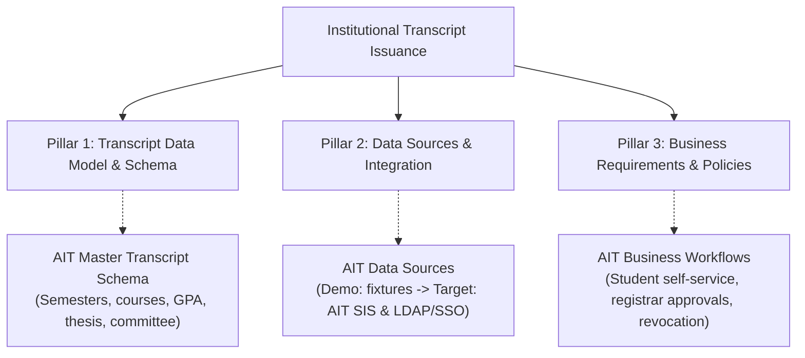

# Project Scope & Objectives

## 1. Project Mission

The `ait-transcript` project serves as a reference implementation and demonstration platform showing how a higher-education institution can issue, manage, and verify official academic transcripts as **W3C Verifiable Credentials (VCs)**.

As defined in [The Role & Functionality of a Complete University VC Issuer](./README.md), a complete issuer must bridge decentralized identity standards (OpenID4VCI, VDR, VCGA, Wallets) with internal university systems. For this solution to work for **any university**—and specifically for the **Asian Institute of Technology (AIT)**—it depends on three core pillars:

---

## 2. The 3 Foundational Pillars

### Pillar 1: Transcript Data Model and Schema
Before issuing any credential, an institution must establish the semantic data model of an academic transcript:
- **General Institutional Requirements**:
  - Mapping course blocks, terms, course titles, codes, credit units, letter grades, and grade point averages (semester GPA and cumulative GPA).
  - Degree conferral details, graduation dates, academic honors, and faculty/school classifications.
  - Alignment with international academic schema standards (e.g., W3C VC JSON-LD context, Comprehensive Learner Record (CLR), or European Learning Model (ELM)).
- **AIT Scope**:
  - Encapsulates the official **AIT Master Transcript** data structure.
  - Claims model includes student identity (`registrationNo`, `fullName`, `dateOfBirth`, `country`), program metadata (`faculty`, `academicProgram`, `option`, `degreeAwarded`), semester course arrays (`courses`), thesis details (`thesisTitle`, `thesisGrade`, `programCommittee`), and credit totals.
  - High-fidelity PDF rendering matching the official AIT physical transcript template (vendored from Credential Lab `aittranscript` preset).

### Pillar 2: Data Sources and System Integration
A credential issuer is not the system of record; it extracts and transforms trusted data from existing campus infrastructure:
- **General Institutional Requirements**:
  - Authoritative connection to the campus Student Information System (SIS), ERP, or database.
  - Single Sign-On (SSO) integration with campus Identity Providers (IdP) for student and staff authentication (SAML / OIDC / LDAP / Active Directory).
  - Synchronization mechanisms: real-time query APIs, secure event streams (e.g. graduation event triggers), or batch ingestion pipelines.
- **AIT Scope**:
  - **Demo Phase (Current)**: Pre-seeded mock student fixtures (`data/students.json`) converted into Certify CSV provider format (`vc-stack/config/student_identity_data.csv`) and Keycloak `inji` realm accounts.
  - **Pilot / Production Target**: Direct integration with AIT's central SIS/Registrar database and campus single sign-on.

### Pillar 3: Business Requirements and Institutional Policies
The issuer must enforce institutional governance, academic regulations, and registrar workflows:
- **General Institutional Requirements**:
  - Rules governing when a transcript can be issued (on-demand student request vs automated graduation issuance).
  - Hold policies (blocking issuance if tuition, library fees, or administrative clearances are outstanding).
  - Registrar review gates (manual staff sign-off vs automated instant verification).
  - Revocation and re-issuance lifecycle (handling retroactive grade changes, course withdrawals, or degree rescissions).
- **AIT Scope**:
  - **Student Self-Service**: Students log into the demo portal (`app/`) and request their transcript credential.
  - **Registrar Review & Approval Gate**: Registrar reviews pending requests, with the ability to approve or reject before credentials become claimable.
  - **Revocation Management**: Registrars can revoke previously issued credentials directly via the UI, updating W3C Bitstring Status Lists in Inji Certify in real time.

---

## 3. System Architecture & Components for AIT

The AIT reference implementation instantiates the two integration boundaries defined in [README.md](./README.md):

| Integration Boundary | System Component | Implementation in `ait-transcript` |
|---|---|---|
| **Boundary 1: VC Ecosystem** | **Issuance Engine** | **Inji Certify**: Exposes OpenID4VCI endpoints, signs VCs, manages Bitstring Status Lists (backed by local PostgreSQL operational cache) |
| | **Student Wallet** | **Inji Web**: Browser wallet where students claim and hold their transcript VCs |
| | **Verification Service** | **Inji Verify**: Verifies cryptographic signatures, issuer trust, and revocation status |
| | **Trust / VDR** | Sandbox `did:key` signing and local status list hosting |
| **Boundary 2: AIT Campus Systems** | **Campus Identity** | **Keycloak**: Simulates AIT institutional OIDC student authentication / broker |
| | **Registrar & Student Gateway** | **Demo App (`app/`)**: Lightweight business logic gateway managing student requests, registrar approvals, holds, and VM wake-up triggers |
| | **Academic Records (SIS)** | **Mock Student Fixture (`data/`)**: Canonical JSON data generating Certify identity rows |
| | **Visual Rendering** | **AIT Master Transcript Template**: Velocity HTML template generating exact A4 transcript PDFs with verification QR codes |

---

## 4. Boundaries and Non-Goals

To maintain a reliable and repeatable reference demo, the following items are intentionally out of scope for the current baseline:

- **Not a Production Pilot**: Uses local `did:key` signing rather than a production PKI/VDR (`did:web` / Trusted Issuers List).
- **Mock Data Layer**: Operates on seeded JSON records rather than live campus SIS / LDAP connections.
- **UI-Level Approval Gating**: Approval is enforced within the demo app's workflow layer rather than an Inji Certify plugin (see [Approval gate](../concepts/approval-gate.md)).
- **Single Credential Focus**: Specifically engineered for the AIT Master Transcript credential.

---

## 5. Project Milestones Roadmap

The `wiki/project/` section serves as the record for key project phases and milestones:

- **[Milestone (2026): AIT Institutional Integration](./milestone-2026-ait-integration.md)**: The foundational milestone focusing strictly on **Integration Boundary 2 with AIT** (AIT Master Transcript schema, mock data syncing, registrar review/approval portal, and print-accurate A4 PDF styling), while keeping Boundary 1 in a self-contained local Docker stack.
- **Future Milestones (Post-2026)**:
  - **Boundary 1 Expansion**: Transitioning to production `did:web` on `ait.ac.th`, registration with higher-education VCGA / Trusted Issuers Lists, and multi-wallet interoperability testing.
  - **Boundary 2 Deepening**: Direct live API adapters to AIT's central Student Information System (SIS) and enterprise single sign-on (SSO).

---

## Related Documentation

- [Complete University VC Issuer Functionality](./README.md)
- [Milestone (2026): AIT Institutional Integration](./milestone-2026-ait-integration.md)
- [PRD.md](../../PRD.md)
- [Local stack architecture](../architecture/vc-stack.md)
- [Transcript credential design](../concepts/transcript-credential.md)
- [Approval gate](../concepts/approval-gate.md)
- [VC revocation](../concepts/vc-revocation.md)
