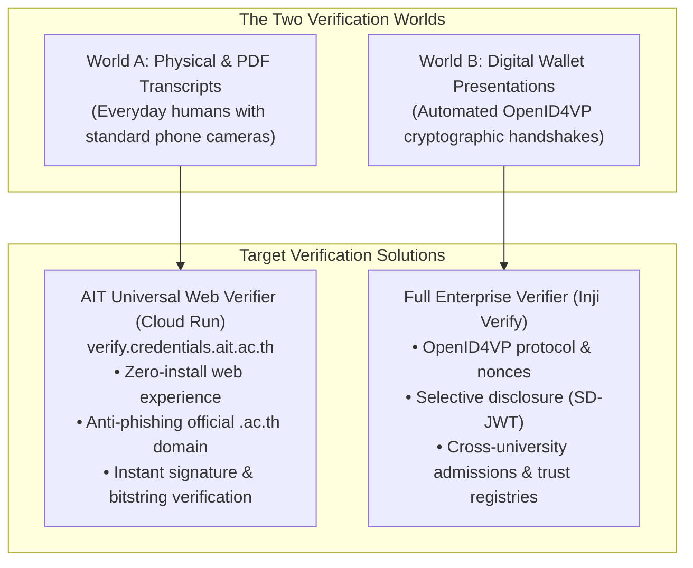
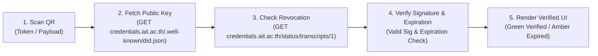

# Verifier Scope & Architecture: From Physical PDFs to Digital Presentations

> [!NOTE]
> **Companion Document**: This specification is a dedicated architectural companion to [The Role & Functionality of a Complete University VC Issuer](./README.md). While the Issuer manages the *outbound creation and lifecycle* of credentials, this document governs how those credentials are *inspected, cryptographically validated, and consumed* by third parties.

---

## 1. The Fundamental Asymmetry: Transcripts as Outbound Attestations

In higher education, academic transcripts exhibit a fundamental architectural asymmetry:

> **An academic transcript is an outbound attestation for the outside world, not an internal campus access token.**

* **No Internal Loopback**: AIT already possesses the student's authoritative grades in its central SIS. A student has no operational reason to present an AIT transcript back to AIT.
* **External Consumption**: Transcripts travel exclusively into the hands of third parties:
  - Corporate recruiters and HR departments.
  - Foreign university admissions committees.
  - Embassies, visa offices, and immigration authorities.
  - Professional accreditation and licensing boards.

Consequently, the verifier architecture must solve for **two completely different external presentation channels**:



---

## 2. World A: The "Everyday Human Problem" & AIT Web Verifier

### 2.1 The Everyday Human Reality
When an alumnus prints their transcript or emails an A4 PDF, the inspecting human (a corporate recruiter or visa officer) **does not have a specialized W3C Verifiable Credential app installed**. They only have a standard smartphone camera (iPhone / Android).

If AIT does not provide a web verifier:
* Scanning a raw cryptographic QR code dumps 2,000 characters of cryptic JSON-LD text on their phone.
* Directing users to a third-party commercial verifier creates suspicion and phishing concerns (*"Why is an official university transcript sending me to an unknown domain instead of `ait.ac.th`?"*).

### 2.2 The Solution: `verify.credentials.ait.ac.th`
AIT hosts a public, lightweight web verification portal under its official domain:
1. **Universal Zero-Install Experience**: Any native smartphone camera scans the QR code and opens `https://verify.credentials.ait.ac.th`.
2. **Instant Tamper Detection**: The browser loads the official verified transcript data directly from the cryptographic payload, immediately exposing any visual tampering on the paper or PDF.
3. **Institutional Trust**: The employer sees the green lock and the official `ait.ac.th` domain.

### 2.3 QR Code Architecture Across Document & Wallet Types

To avoid confusing end users, the architecture defines a clean separation of QR types:

| Context / Document | QR Format & Payload | Verification Mechanism | Target Audience / Use Case |
|---|---|---|---|
| **Downloaded A4 PDF Transcript (Modality 2)** | **Offline Embedded VC**<br/>(Signed VC object without presentation envelope) | 100% offline verification via Inji Verify or cryptographic tools | Embassies, consular posts, border control, general digital archiving |
| **Physical Paper Transcript (Registrar Counter VDS)** | **Online Web URL**<br/>(`https://verify.credentials.ait.ac.th/v/<id>`) | Everyday smartphone camera opens Cloud Run verifier | Employers, campus visitors, physical admissions inspection |
| **Wallet Onboarding Screen (Modality 1)** | **OpenID4VCI Credential Offer**<br/>(`openid-credential-offer://...`) | Scanned by mobile wallet to initiate key-bound issuance handshake | Students claiming credential into Inji / Apple / Google Wallet |

---

## 3. Serverless Implementation: Why Cloud Run is the Dream Architecture

For verifying AIT's own PDF transcripts, using heavy enterprise engines (like Java Spring Boot) is severe overkill. The verification of an AIT transcript is a **purely stateless, read-only mathematical operation**:

> [!NOTE]
> **Perpetual Official Documents vs. Expiring Self-Service PDFs**:
> - **Official Registrar Physical Transcripts**: Issued with perpetual validity (omits `validUntil`), verified permanently against AIT's public key and the Bitstring revocation list.
> - **Self-Service Downloaded PDFs & Home Printouts**: Configured with a time-bound expiration window (e.g., valid for 90 days via `validUntil`) to prevent unmaintained digital files or loose printouts from circulating indefinitely. When scanned after expiration, the verifier displays an amber notice instructing the reviewer to request a fresh download or an official registrar transcript.



### Why Google Cloud Run is the Optimal Choice:
1. **True Scale-to-Zero ($0.00 / month cost)**:
   - When no one is scanning a transcript, Cloud Run scales to **0 active instances**. Compute cost is literally **$0**.
   - With Google Cloud Run's free tier (2 million requests/month), AIT pays $0 for the verifier indefinitely.
2. **Sub-Second Cold Starts (< 300ms)**:
   - Built with a lightweight Node.js, Go, or Python runtime, containers spin up in 200–300 milliseconds. Verifiers experience no perceptible delay.
3. **Zero State & Zero Database Dependencies**:
   - The verifier connects to no database. It resolves public keys and Bitstring Status Lists from the public CDN / VDR via simple HTTP GET requests.
4. **Infinite Elasticity**:
   - Handles global hiring peaks (thousands of simultaneous scans) without degrading or affecting the core Issuer engine.

---

## 4. World B: Digital Wallet Presentations (OpenID4VP)

When interacting directly with a student's digital wallet (e.g. for admissions or digital recruitment), verification moves to **OpenID for Verifiable Presentations (OpenID4VP)**.

### 4.1 The Two-Layer Cryptographic Envelope (VP vs. VC)
A digital presentation consists of two nested cryptographic layers:

```
┌─────────────────────────────────────────────────────────────────────────────┐
│ ✉️ VERIFIABLE PRESENTATION (The Outer Envelope)                             │
│ • Created by:  Student's Wallet                                            │
│ • Signed by:   Wallet Private Key (did:key:wallet...)                       │
│ • Contains:    Fresh Nonce + Target Domain ("admissions.ait.ac.th")         │
│                                                                             │
│   ┌─────────────────────────────────────────────────────────────────────┐   │
│   │ 📜 VERIFIABLE CREDENTIAL (The Inner Transcript)                     │   │
│   │ • Created by:  Undergraduate University (Issuer)                    │   │
│   │ • Signed by:   Issuer Private Key (did:web:chula.ac.th)             │   │
│   │ • Bound to:    credentialSubject.id = "did:key:wallet..."           │   │
│   │ • Content:     Degree, GPA, Semester Course Table                   │   │
│   └─────────────────────────────────────────────────────────────────────┘   │
└─────────────────────────────────────────────────────────────────────────────┘
```

* **Step 1 (Outer Envelope Validation)**: Verifies the wallet's private key signature, the fresh nonce, and domain targeting. **Proves the applicant is live and owns the private key (Anti-Replay / Proof-of-Possession).**
* **Step 2 (Inner Credential Validation)**: Verifies the university's digital signature against its public DID and checks the Bitstring Status List. **Proves the grades are authentic and unrevoked.**
* **Step 3 (Holder Binding Link)**: Confirms that `Outer Signer Key == Inner Subject ID`. **Guarantees that a stolen credential file cannot be presented by someone else.**

---

## 5. Selective Disclosure vs. Full Transcript Requirements

In decentralized identity, there is a crucial distinction between what a protocol *supports* and what a university *requires*:

### 5.1 When the Entire Transcript is Mandatory
For academic applications (Master's or Ph.D. admissions), partial disclosure is insufficient:
* The admissions committee requires the **complete course history**, credit values, letter grades, and degree conferral details.
* Via OpenID4VP Presentation Definitions, AIT specifies that the **entire, unredacted Verifiable Credential** must be presented inside the VP.

### 5.2 Selective Disclosure (SD-JWT) for Non-Academic Checks
When full disclosure is not required (e.g., student discounts, career fair initial screening), AIT can request **Selective Disclosure (IETF SD-JWT VC)**:
* The student reveals *only* `cumGpa: 3.85` or `degreeAwarded: "Master of Engineering"`.
* All course rows, birth dates, and national identity numbers remain cryptographically redacted.
* The revealed claims cannot be forged because they remain anchored in the university's root hash tree.

### 5.3 Zero-Knowledge Proofs (ZKPs): Industry Status
* **Not Mandated**: True ZK-predicates (proving $x \ge 3.0$ without revealing the number) are **not legally or technically mandated anywhere in the world** in 2026.
* **Why SD-JWT Wins Today**: Major frameworks (European Union eIDAS 2.0 / EUDI, NIST SP 800-63-4, and MOSIP) standardize on **SD-JWT** because it satisfies GDPR Data Minimization while executing in 2 milliseconds on any budget smartphone without specialized pairing-friendly hardware.

---

## 6. Implementation Architecture Matrix: Cloud Run vs. Inji Verify

| Dimension | AIT Web Verifier (`verify.credentials.ait.ac.th`) | Enterprise Inji Verify (`inji-verify`) |
|---|---|---|
| **Primary Mission** | Verifying AIT's own printed PDF and digital transcripts | Incoming cross-university admissions & multi-wallet digital verification |
| **Supported Inputs** | Smartphone camera QR scan, PDF file drag-and-drop | OpenID4VP interactive wallet QR, BLE, mDoc, SD-JWT |
| **Technology Stack** | Stateless Node.js / Python / Go on **Google Cloud Run** | Java Spring Boot microservice + React frontend |
| **Compute Profile** | **Scale-to-Zero ($0/month)**, < 300ms warm-up | Long-running container, requires JVM memory |
| **Trust Scope** | Scoped to AIT's own DID and status lists | Multi-issuer, federated national trust registries (VCGAs) |
| **Deployment Recommendation** | **Deploy in 2026 Milestone** for PDF verification | **Deploy Post-2026** if launching a digital admissions portal |

---

## Related Documentation

- [Institutional VC Issuer Proposal](./proposal-issuer.md)
- [Local stack architecture](../architecture/vc-stack.md)
- [Transcript credential design](../concepts/transcript-credential.md)
